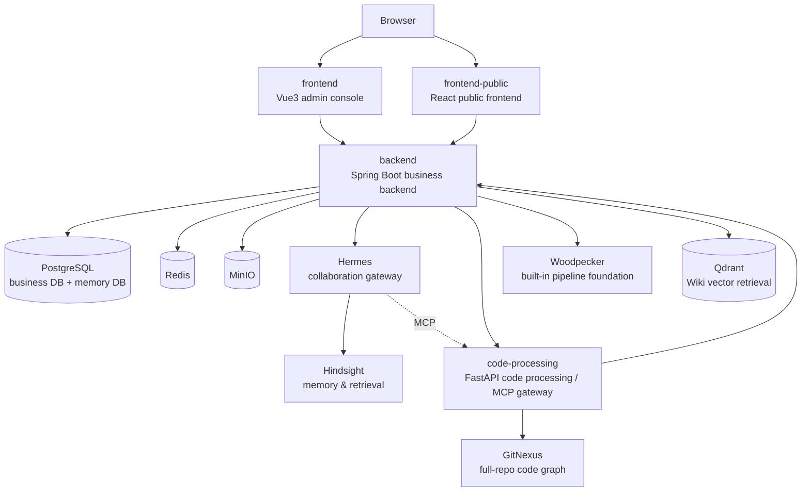

<div align="center">

# 🤖 AI Club · AI Agent Engineering Management Platform

[简体中文](README.md) | **English**

**Bring projects, iterations, requirements, testing, code repositories, pipelines, runtime observability, knowledge bases, and agent collaboration together under a single project lens.**

Lets engineering teams continuously complete the **Plan → Develop → Test → Release → Observe → Retrospect** loop around a single project, and brings AI agents into daily engineering workflows through the Hermes conversational assistant.

<br/>


</div>

---

## 📖 Table of Contents

- [Product Positioning](#-product-positioning)
- [Core Capabilities](#-core-capabilities)
- [System Architecture](#-system-architecture)
- [Tech Stack](#-tech-stack)
- [Directory Structure](#-directory-structure)
- [Quick Start](#-quick-start)
- [Script Entry Points](#-script-entry-points)
- [Services & Ports](#-services--ports)
- [AI Club Pipeline / Woodpecker](#-ai-club-pipeline--woodpecker)
- [Harness Verification](#-harness-verification)
- [Documentation](#-documentation)
- [Roadmap](#-roadmap)

---

## 🎯 Product Positioning

AI Club targets software engineering teams. Its goal is **not to replace any single development tool, but to bring the critical context scattered across many tools together under a single project lens**, then wire AI agents into real engineering workflows through the conversational assistant, execution center, code-processing service, and model management.

The platform is built around three core ideas:

- **Unified project lens** — iterations, work items, test plans, code repositories, pipelines, runtime instances, and knowledge bases all hang off the project dimension, so cross-tool context is no longer fragmented.
- **Controlled AI collaboration** — Hermes never reads or writes the database directly; it accesses platform data through controlled MCP tools. Write operations default to generating "pending action cards" that only execute after user confirmation.
- **Traceable and governable** — async tasks, auto-merge, pipelines, automated testing, and patrol runs are fully traceable; sensitive credentials are always stored as ciphertext, and key actions land in the audit log.

> The platform has evolved from its original three-module scaffold into a complete engineering system comprising **admin console + public frontend + business backend + code-processing service + Hermes collaboration gateway + Hindsight memory service + vector retrieval + built-in pipeline foundation**.

---

## ✨ Core Capabilities

<table>
<tr>
<td width="50%" valign="top">

### 📋 Engineering Management
- **Project management** — projects/members/status, the carrier for project-level data permissions
- **Iterations & work items** — requirements, tasks, defects, comments, attachments
- **Test management** — test plans, cases, Playwright automation orchestration
- **Execution center** — unified scheduling of AI tasks, repo scans, dev execution, automated testing

</td>
<td width="50%" valign="top">

### 🔗 Code & Release
- **GitLab integration** — repo binding, OAuth, product-branch sync, MR assistance
- **AI auto-merge** — historical-issue carry-over, strictness gating, review cache, outbound webhooks
- **Pipeline center** — built-in Woodpecker provider + external Jenkins compatibility
- **GitNexus repo graph** — code-structure snapshots, call chains, full-repo knowledge graph

</td>
</tr>
<tr>
<td width="50%" valign="top">

### 🧠 AI Collaboration
- **Hermes assistant** — platform-wide, context-aware, action-card confirmation
- **Requirement AI assistant** — standardize requirements, break down subtasks, generate test cases
- **API test-case generation** — reviewable AI suggestions based on API assets
- **Model management + benchmarking** — token metering, cross-model benchmarks

</td>
<td width="50%" valign="top">

### 📊 Knowledge & Observability
- **Wiki center** — spaces/directories/pages, version restore, hybrid search
- **Memory fact graph / logic graph** — visualize project and knowledge relationships
- **Observability center** — application logs, health trends, runtime instances
- **Server management** — SSH terminal, SFTP, resource monitoring, alerts

</td>
</tr>
</table>

### 🛡️ Platform Governance

Users / roles / function permissions / project data permissions · tool configuration · environment-variable fixed registry · home-page shortcuts · PR review stats · notification center · feedback management · operation audit log · public-side credit billing · project read-only sharing · self-upgrade center (patrol → suggestion → remediation loop)

> Permissions are split into two layers: **function permissions** (whether a user can enter a page / call an API) and **data permissions** (which projects and their bound resources a user can see once they have function permission). See [docs/current-permission-model.md](docs/current-permission-model.md).

---

## 🏗️ System Architecture

The system uses a frontend-backend separation plus multi-service collaboration architecture:



| Service | Responsibility |
| --- | --- |
| `frontend` | Vue 3 + Element Plus admin console, for the private-deployment backoffice and platform governance |
| `frontend-public` | React + Vite public frontend, for open registration, project collaboration, and the SaaS experience |
| `backend` | Spring Boot business backend — core business, permissions, persistence, tool orchestration, action cards |
| `code-processing` | FastAPI code-processing service — code scanning, MR review, GitNexus hosting; exposes platform tools to Hermes as an MCP Server |
| `hermes` | Conversational collaboration gateway, integrates platform tools via API Server + MCP |
| `hindsight` | Memory & retrieval service, provides per-user session memory for Hermes |
| `woodpecker` | Built-in pipeline foundation (server + agent), enabled by default |
| `postgres` | Unified PostgreSQL, hosting business DB `ai_agent_platform` and memory DB `hindsight` |
| `qdrant` | Dedicated vector backend for Wiki knowledge retrieval |
| `redis` / `minio` | Cache & session support / object storage for files and execution artifacts |

> Key design: `code-processing` is both a "code analysis service" and an "MCP tool gateway"; Hermes accesses platform data through it in a controlled way, with write operations landing as pending action cards. See [docs/architecture.md](docs/architecture.md) for full details.

---

## 🧰 Tech Stack

| Layer | Technology |
| --- | --- |
| Admin frontend | Vue 3 · Vite · TypeScript · Element Plus |
| Public frontend | React 18 · Vite · TypeScript · React Router · Zustand · Tailwind CSS |
| Backend | Spring Boot 3 · Spring Web · Spring Data JPA · Flyway · PostgreSQL · Redis |
| Code processing | Python · FastAPI · GitNexus CLI · Playwright |
| AI collaboration | Hermes (API Server + MCP) · Hindsight memory service |
| Retrieval | Qdrant vector store · DB keyword candidates · dedicated reranker hybrid search |
| Pipelines | Woodpecker (built-in provider) · Jenkins (external compatibility) |
| Infrastructure | PostgreSQL · Redis · MinIO · Docker Compose |

---

## 📁 Directory Structure

```text
git-ai-club/
├─ frontend/                  # Vue3 + Element Plus admin console
├─ frontend-public/           # React + Vite public frontend
├─ backend/                   # Spring Boot business backend
│  └─ src/main/resources/db/migration/  # Flyway database migration scripts
├─ code-processing/           # Python FastAPI code processing / MCP gateway
├─ docker/                    # Docker builds & localized images per service (incl. gitnexus-web)
├─ docs/                      # Architecture, PRD, and topic technical-design docs
├─ scripts/                   # Start / stop / restart / package / harness scripts
├─ docker-compose.yml         # Source-mode dependency orchestration, with optional woodpecker profile
├─ docker-compose.server.yml  # Full Docker orchestration
└─ README.md
```

---

## 🚀 Quick Start

> The scripts are the recommended one-command path; they automatically bring up dependency containers and start business services from source.

### Source mode (local development)

```bash
# Windows
powershell -ExecutionPolicy Bypass -File .\scripts\start.ps1

# Linux
bash ./scripts/start-linux.sh
```

The source-mode scripts automatically:

1. Start `postgres`, `redis`, `minio`, `qdrant`, `hindsight`, `gitnexus-web`, `hermes`, `woodpecker-server`, `woodpecker-agent` containers (skipping Woodpecker when `WOODPECKER_ENABLED=false` is set explicitly)
2. Install admin and public frontend dependencies
3. Check and create `code-processing/.venv`
4. Start `code-processing`, `backend`, `frontend`, `frontend-public`
5. Write logs to `.run-logs/` in the project root

### Full Docker mode (test / server deployment)

```bash
# Windows
powershell -ExecutionPolicy Bypass -File .\scripts\start-docker.ps1

# Linux
bash ./scripts/start-docker-linux.sh
```

Full Docker mode uses `docker-compose.server.yml` and `.env.server` by default. If `.env.server` does not exist, the script first generates one from `.env` suitable for inter-container networking.

### Manual per-service startup

<details>
<summary>Expand to see commands for starting each service manually</summary>

**1. Start PostgreSQL**

```bash
docker compose up -d
```

Default database configuration:

| Item | Value |
| --- | --- |
| Host | `localhost` |
| Port | `5432` |
| Database | `ai_agent_platform` |
| Username | `aiclub` |
| Password | `aiclub123` |

> The database schema is managed entirely by Flyway; migration scripts under `backend/src/main/resources/db/migration` run automatically on the first backend startup. To reinitialize the database: `docker compose down -v && docker compose up -d`.
>
> If PostgreSQL uses a complex password and you need to start `hindsight`, it is recommended to write `HINDSIGHT_API_DATABASE_URL` in `.env` / `.env.server` as a password-free connection string and supply the password separately via `HINDSIGHT_API_DATABASE_PASSWORD` or `POSTGRES_PASSWORD`, to avoid escaping issues when a complex password passes through the Alembic / SQLAlchemy URL parsing chain.

**2. Start the backend**

```bash
cd backend
mvn -s maven-settings-central.xml spring-boot:run
```

**3. Start the admin frontend**

```bash
cd frontend
npm install
npm run dev
```

**4. Start the code-processing service**

```bash
cd code-processing
python -m venv .venv
.venv\Scripts\activate
pip install -e .
uvicorn app.main:app --reload --port 9000
```

</details>

---

## 🧭 Script Entry Points

> On Windows use `powershell -ExecutionPolicy Bypass -File .\scripts\<script>`, on Linux use `bash ./scripts/<script>`. The table lists the corresponding script names.

| Action | Windows | Linux |
| --- | --- | --- |
| Start source mode | `start.ps1` | `start-linux.sh` |
| Stop source mode | `stop-windows.ps1` | `stop-linux.sh` |
| Restart source services (leave middleware) | `restart-source.ps1` | `restart-source-linux.sh` |
| Start full Docker | `start-docker.ps1` | `start-docker-linux.sh` |
| Stop full Docker | `stop-docker.ps1` | `stop-docker-linux.sh` |
| Package full Docker | `package.ps1` | `package-linux.sh` |

**Ops utility scripts:**

- **Hindsight vector rebuild** — `python ./scripts/rebuild_hindsight_vectors.py`
  Backs up the `hindsight` database, clears old vector snapshots, and re-ingests platform-managed memory data based on current Wiki pages.
- **Environment-variable upgrade** — `bash ./scripts/upgrade-env.sh`
  Incrementally fills newly added config items from `.env.example` / `.env.server.example` into the corresponding env files, and flags fields that still need manual completion.
- **PostgreSQL collation check** — `python ./scripts/check_postgres_collation.py`
  Checks the collation version mismatch of `ai_agent_platform` / `hindsight`; checks only by default, and only runs backup, `REINDEX DATABASE`, and `ALTER DATABASE ... REFRESH COLLATION VERSION` when `--apply` is appended.

---

## 🌐 Services & Ports

| Service | Default address |
| --- | --- |
| Frontend (admin) | `http://localhost:5173` |
| Frontend (public) | `http://localhost:5175` |
| Backend | `http://localhost:8080` |
| Code Processing | `http://localhost:9000` |
| Hermes | `http://localhost:18080` |
| Qdrant | `http://localhost:16333` |
| Hindsight | `http://localhost:18888` |
| GitNexus Web UI | `http://localhost:5174` |
| Woodpecker (enabled by default) | `http://localhost:18000` |

> The GitNexus Web UI is built as a localized Chinese image via `docker/gitnexus-web` based on the official image, keeping page port `5174`; the `gitnexus serve` on `4747` is still brought up on demand by `code-processing` during code-structure navigation.

---

## 🔧 AI Club Pipeline / Woodpecker

The platform ships Woodpecker as the default pipeline provider, with the unified "Pipeline Center" as the frontend entry. Business users only log into AI Club — they do not need to log into Woodpecker; the Woodpecker UI serves only as an admin troubleshooting entry. External Jenkins-compatible bindings also appear in the same pipeline list, but the Jenkins service-instance management page is demoted to a secondary entry.

Woodpecker is enabled by default; admins only need to fill the deployment-level config in `.env` or `.env.server`:

```bash
WOODPECKER_HOST=http://localhost:18000
WOODPECKER_AGENT_SECRET=<random strong secret>
PLATFORM_WOODPECKER_API_TOKEN=<Woodpecker access token>
```

AI Club does not carry Woodpecker's GitLab OAuth config in `.env`. GitLab repo identity, MRs, and auto-merge still use the platform's existing GitLab config; Woodpecker only acts as the background execution foundation, authorized for platform calls via `PLATFORM_WOODPECKER_API_TOKEN`. In source mode the backend calls `http://localhost:18000` by default; in full Docker it calls `http://woodpecker-server:8000`. To disable temporarily, set `WOODPECKER_ENABLED=false`. Running Compose manually requires the profile:

```bash
docker compose --env-file .env --profile woodpecker -f docker-compose.yml up -d woodpecker-server woodpecker-agent
```

When the target branch lacks `.woodpecker.yml`, the "complete config" action on the detail page generates the config via a template parameter form: the user fills in project root directory, push server address, branch, Docker credentials, SSH host and private key, etc.; the platform creates a GitLab MR and writes sensitive values into Woodpecker repo secrets. "Deploy to server" is a shared post-action attached to Java / Node / Python / Docker templates. Advanced users can still switch to manual YAML mode. See [docs/generated/pipeline-woodpecker-provider-technical-design-v1.md](docs/generated/pipeline-woodpecker-provider-technical-design-v1.md) for the detailed design.

---

## ✅ Harness Verification

To verify documentation, scripts, and multi-service changes in a unified way, the repo provides a harness entry:

```bash
# Windows
powershell -ExecutionPolicy Bypass -File .\scripts\harness.ps1 -Target <target>

# Linux
bash ./scripts/harness-linux.sh <target>
```

| `Target` | Meaning |
| --- | --- |
| `docs` | Check `AGENTS.md`, `README.md`, `docs/`, `scripts/` for encoding and mojibake risks |
| `backend` | Check `backend/` encoding and run Maven tests |
| `frontend` | Check `frontend/` encoding and run the frontend build |
| `code-processing` | Check `code-processing/` encoding and run a Python package-install check |
| `all` | Run the full harness across the whole repo |

**Architecture & design-doc conventions:**

- After any technical architecture change, cross-module redesign, or large technical design, you must update [docs/architecture.md](docs/architecture.md) or add a topic design doc.
- Prefer creating `docs/<topic>-architecture-v1.md` or `docs/<topic>-technical-design-v1.md` based on [docs/architecture-design-template.md](docs/architecture-design-template.md).
- If a change also affects startup, environment variables, log paths, or the harness, update `README.md`, `AGENTS.md`, and the corresponding topic doc in the same delivery.

---

## 📚 Documentation

| Document | Content |
| --- | --- |
| [docs/ai-club-user-prd-v1.md](docs/ai-club-user-prd-v1.md) | **User-side PRD** — product overview, roles, business flows, feature scope, and acceptance criteria |
| [docs/architecture.md](docs/architecture.md) | **Architecture** — module responsibilities, core business chains, data & config, run modes |
| [docs/current-permission-model.md](docs/current-permission-model.md) | Current permission model (function + data permissions) |
| [docs/observability-technical-design-v1.md](docs/observability-technical-design-v1.md) | Observability center (project logs + health monitoring) technical design |
| [docs/public-saas-frontend-technical-design-v1.md](docs/public-saas-frontend-technical-design-v1.md) | Public SaaS product frontend technical design |
| [docs/public-credit-technical-design-v1.md](docs/public-credit-technical-design-v1.md) | Public-side credit billing technical design |
| [docs/api-studio-native-technical-design-v1.md](docs/api-studio-native-technical-design-v1.md) | Native API workbench technical design |
| [docs/wiki-knowledge-graph-technical-design-v1.md](docs/wiki-knowledge-graph-technical-design-v1.md) | Wiki knowledge-graph technical design |
| [docs/model-benchmark-technical-design-v1.md](docs/model-benchmark-technical-design-v1.md) | Model benchmark technical design |
| [docs/encoding-guide.md](docs/encoding-guide.md) | UTF-8 and Chinese anti-mojibake conventions |
| [docs/harness-best-practices.md](docs/harness-best-practices.md) | Harness best practices and agent collaboration conventions |
| [AGENTS.md](AGENTS.md) | Repo-level agent entry point |

---

## 🛣️ Roadmap

- Gradually introduce clearer layering in the backend (`domain / application / infrastructure / interface`) to slim down the heavy `service` layer.
- Add dedicated architecture docs and sequence descriptions for Hermes, the execution center, repo scanning, and GitLab management.
- Advance the native API workbench (`api-studio`) to closure and gradually retire the Yaade iframe transitional approach.
- Extend the observability center with more health dimensions and project-level SLA aggregation.
- Upgrade the project read-only sharing page into a fuller release-record view (version numbers, related MRs, release notes).
- Build out user-facing help docs and operation manuals for typical roles.

---

<div align="center">

**AI Club** · Bring the critical context of dev tools together under a single project lens.

</div>
