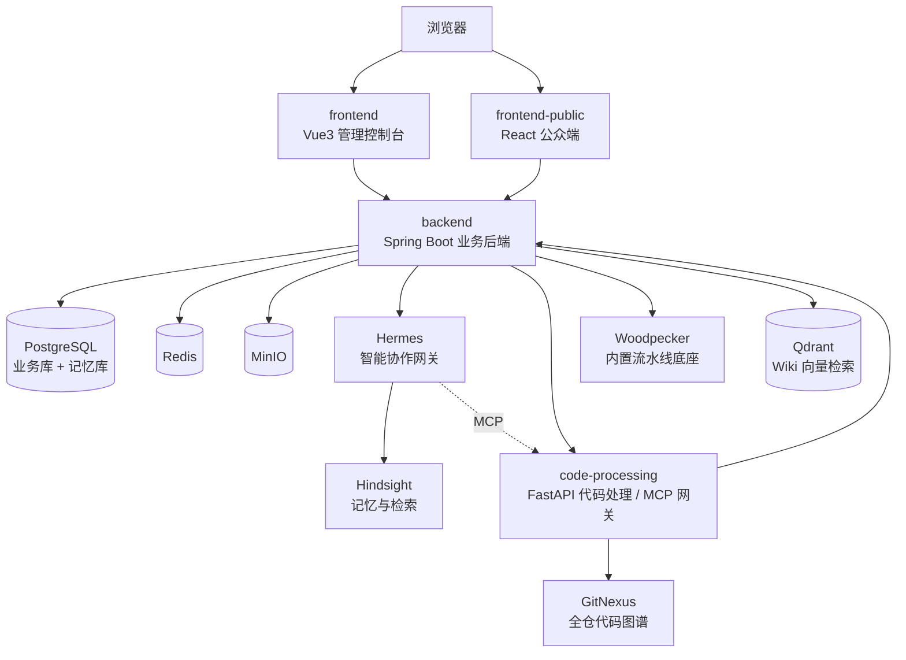

<div align="center">

# 🤖 AI Club · AI 代理工程管理平台

**简体中文** | [English](README.en.md)

**把项目、迭代、需求、测试、代码仓库、流水线、运行观测、知识沉淀与智能体协作，收口到同一个项目视角下。**

让研发团队围绕一个项目持续完成「规划 → 开发 → 测试 → 发布 → 观测 → 复盘」的工程闭环，并通过 Hermes 对话式智能助手把 AI 代理真正接入日常工程流程。

<br/>


</div>

---

## 📖 目录

- [产品定位](#-产品定位)
- [核心能力](#-核心能力)
- [系统架构](#-系统架构)
- [技术栈](#-技术栈)
- [目录结构](#-目录结构)
- [快速开始](#-快速开始)
- [脚本入口](#-脚本入口)
- [服务与端口](#-服务与端口)
- [AI Club Pipeline / Woodpecker](#-ai-club-pipeline--woodpecker)
- [Harness 验证](#-harness-验证)
- [文档导航](#-文档导航)
- [后续规划](#-后续规划)

---

## 🎯 产品定位

AI Club 面向软件研发团队，目标**不是替代单一研发工具，而是把多套工具中的关键上下文收口到项目视角下**，再通过对话式智能助手、执行中心、代码处理服务与模型管理能力，把 AI 代理接入真实的工程流程。

平台围绕三个核心理念构建：

- **统一项目视角** — 迭代、工作项、测试计划、代码仓库、流水线、运行实例、知识库都挂在项目维度，跨工具上下文不再割裂。
- **受控的 AI 协作** — Hermes 不直接读写数据库，而是通过 MCP 工具受控访问平台数据；写操作默认生成「待确认动作卡片」，由用户确认后才执行。
- **可追踪与可治理** — 异步任务、自动合并、流水线、自动化测试、巡检执行全程状态可追踪，敏感凭据一律密文存储，关键操作进入审计日志。

> 平台已经从最初的三模块脚手架，演进为包含 **管理控制台 + 公众端 + 业务后端 + 代码处理服务 + Hermes 智能协作网关 + Hindsight 记忆服务 + 向量检索 + 内置流水线底座** 的完整工程系统。

---

## ✨ 核心能力

<table>
<tr>
<td width="50%" valign="top">

### 📋 工程管理
- **项目管理** — 项目/成员/状态，项目级数据权限载体
- **迭代与工作项** — 需求、任务、缺陷、评论、附件
- **测试管理** — 测试计划、用例、Playwright 自动化编排
- **执行中心** — AI 任务、仓库扫描、开发执行、自动化测试统一调度

</td>
<td width="50%" valign="top">

### 🔗 代码与发布
- **GitLab 集成** — 仓库绑定、OAuth、产品分支同步、MR 辅助
- **AI 自动合并** — 历史问题带入、严格度门禁、审查缓存、外发 Webhook
- **流水线中心** — 内置 Woodpecker provider + 外部 Jenkins 兼容
- **GitNexus 全仓图** — 代码结构快照、调用链、全仓知识图谱

</td>
</tr>
<tr>
<td width="50%" valign="top">

### 🧠 AI 协作
- **Hermes 对话助手** — 贯穿平台、上下文感知、动作卡片确认
- **需求 AI 助手** — 标准化需求、拆解子任务、生成测试用例
- **API 测试用例生成** — 基于接口资产生成可审核的 AI 建议
- **模型管理 + 对比测试** — Token 计量、跨模型 Benchmark

</td>
<td width="50%" valign="top">

### 📊 知识与观测
- **Wiki 中心** — 空间/目录/页面、版本恢复、混合检索
- **记忆事实图 / 逻辑图谱** — 项目与知识关系可视化
- **可观测性中心** — 应用日志、健康趋势、运行实例
- **服务器管理** — SSH 终端、SFTP、资源监控、告警

</td>
</tr>
</table>

### 🛡️ 平台治理

用户 / 角色 / 功能权限 / 项目数据权限 · 工具配置 · 环境变量固定注册表 · 首页快捷入口 · PR 评审统计 · 通知中心 · 反馈管理 · 操作日志审计 · 公众端积分扣费 · 项目只读分享 · 自升级中心(巡检 → 建议 → 整改闭环)

> 平台权限分为 **功能权限**(能否进入页面/调用接口)与 **数据权限**(具备功能权限后能看到哪些项目及其绑定资源)两层。详见 [docs/current-permission-model.md](docs/current-permission-model.md)。

---

## 🏗️ 系统架构

当前系统采用前后端分离 + 多服务协作架构：



| 服务 | 职责 |
| --- | --- |
| `frontend` | Vue 3 + Element Plus 管理控制台，面向私有化后台与平台治理 |
| `frontend-public` | React + Vite 公众端，面向公开注册、项目协作与 SaaS 化体验 |
| `backend` | Spring Boot 业务后端，负责核心业务、权限、持久化、工具编排与动作卡片 |
| `code-processing` | FastAPI 代码处理服务，负责代码扫描、MR 审查、GitNexus 托管，并以 MCP Server 向 Hermes 暴露平台工具 |
| `hermes` | 对话式智能协作网关，通过 API Server + MCP 接入平台工具 |
| `hindsight` | 记忆与检索服务，为 Hermes 提供用户会话记忆能力 |
| `woodpecker` | 默认启用的内置流水线底座(server + agent) |
| `postgres` | 统一 PostgreSQL，承载业务库 `ai_agent_platform` 与记忆库 `hindsight` |
| `qdrant` | Wiki 知识检索的专用向量后端 |
| `redis` / `minio` | 缓存与会话支持 / 文件与执行产物对象存储 |

> 关键设计：`code-processing` 同时是「代码分析服务」与「MCP 工具网关」；Hermes 通过它受控访问平台数据，写操作以待确认动作卡片落地。完整说明见 [docs/architecture.md](docs/architecture.md)。

---

## 🧰 技术栈

| 层 | 技术 |
| --- | --- |
| 管理端 | Vue 3 · Vite · TypeScript · Element Plus |
| 公众端 | React 18 · Vite · TypeScript · React Router · Zustand · Tailwind CSS |
| 后端 | Spring Boot 3 · Spring Web · Spring Data JPA · Flyway · PostgreSQL · Redis |
| 代码处理 | Python · FastAPI · GitNexus CLI · Playwright |
| 智能协作 | Hermes(API Server + MCP) · Hindsight 记忆服务 |
| 检索 | Qdrant 向量库 · 数据库关键词候选 · 专用 Reranker 混合检索 |
| 流水线 | Woodpecker(内置 provider) · Jenkins(外部兼容) |
| 基础设施 | PostgreSQL · Redis · MinIO · Docker Compose |

---

## 📁 目录结构

```text
git-ai-club/
├─ frontend/                  # Vue3 + Element Plus 管理端控制台
├─ frontend-public/           # React + Vite 公众端前端
├─ backend/                   # Spring Boot 业务后端
│  └─ src/main/resources/db/migration/  # Flyway 数据库迁移脚本
├─ code-processing/           # Python FastAPI 代码处理 / MCP 网关
├─ docker/                    # 各服务的 Docker 构建与本地化镜像(含 gitnexus-web)
├─ docs/                      # 架构、PRD 与专题技术设计文档
├─ scripts/                   # 启动 / 停止 / 重启 / 打包 / harness 脚本
├─ docker-compose.yml         # 源码模式依赖容器编排，含可选 woodpecker profile
├─ docker-compose.server.yml  # 全量 Docker 编排
└─ README.md
```

---

## 🚀 快速开始

> 推荐使用脚本一键启动；脚本会自动拉起依赖容器并以源码方式启动业务服务。

### 源码模式(本地开发联调)

```bash
# Windows
powershell -ExecutionPolicy Bypass -File .\scripts\start.ps1

# Linux
bash ./scripts/start-linux.sh
```

源码模式脚本会自动完成：

1. 启动 `postgres`、`redis`、`minio`、`qdrant`、`hindsight`、`gitnexus-web`、`hermes`、`woodpecker-server`、`woodpecker-agent` 容器(显式设置 `WOODPECKER_ENABLED=false` 时跳过 Woodpecker)
2. 安装管理端与公众端前端依赖
3. 检查并创建 `code-processing/.venv`
4. 启动 `code-processing`、`backend`、`frontend`、`frontend-public`
5. 将日志写入项目根目录 `.run-logs/`

### 全量 Docker 模式(测试/服务器部署)

```bash
# Windows
powershell -ExecutionPolicy Bypass -File .\scripts\start-docker.ps1

# Linux
bash ./scripts/start-docker-linux.sh
```

全量 Docker 模式默认使用 `docker-compose.server.yml` 和 `.env.server`。如果 `.env.server` 不存在，脚本会优先根据 `.env` 自动生成一份可用于容器互联的配置。

### 手动分服务启动

<details>
<summary>展开查看手动启动各服务的命令</summary>

**1. 启动 PostgreSQL**

```bash
docker compose up -d
```

数据库默认配置：

| 项 | 值 |
| --- | --- |
| Host | `localhost` |
| Port | `5432` |
| Database | `ai_agent_platform` |
| Username | `aiclub` |
| Password | `aiclub123` |

> 数据库结构统一由 Flyway 管理，首次启动后端时会自动执行 `backend/src/main/resources/db/migration` 下的迁移脚本。重新初始化数据库：`docker compose down -v && docker compose up -d`。
>
> 如果 PostgreSQL 使用了复杂密码且需要启动 `hindsight`，推荐在 `.env` / `.env.server` 里把 `HINDSIGHT_API_DATABASE_URL` 写成不带密码的连接串，再通过 `HINDSIGHT_API_DATABASE_PASSWORD` 或 `POSTGRES_PASSWORD` 单独提供密码，避免复杂密码在 Alembic / SQLAlchemy URL 解析链路触发转义问题。

**2. 启动后端**

```bash
cd backend
mvn -s maven-settings-central.xml spring-boot:run
```

**3. 启动管理端前端**

```bash
cd frontend
npm install
npm run dev
```

**4. 启动代码处理服务**

```bash
cd code-processing
python -m venv .venv
.venv\Scripts\activate
pip install -e .
uvicorn app.main:app --reload --port 9000
```

</details>

---

## 🧭 脚本入口

> Windows 使用 `powershell -ExecutionPolicy Bypass -File .\scripts\<脚本>`，Linux 使用 `bash ./scripts/<脚本>`。下表列出对应脚本名。

| 操作 | Windows | Linux |
| --- | --- | --- |
| 源码模式启动 | `start.ps1` | `start-linux.sh` |
| 源码模式停止 | `stop-windows.ps1` | `stop-linux.sh` |
| 源码服务重启(不动中间件) | `restart-source.ps1` | `restart-source-linux.sh` |
| 全量 Docker 启动 | `start-docker.ps1` | `start-docker-linux.sh` |
| 全量 Docker 关闭 | `stop-docker.ps1` | `stop-docker-linux.sh` |
| 全量 Docker 打包 | `package.ps1` | `package-linux.sh` |

**运维工具脚本：**

- **Hindsight 向量重建** — `python ./scripts/rebuild_hindsight_vectors.py`
  备份 `hindsight` 数据库、清理旧向量快照，并按当前 Wiki 页面重新回灌平台托管的记忆数据。
- **环境变量升级** — `bash ./scripts/upgrade-env.sh`
  将 `.env.example` / `.env.server.example` 中新增的配置项增量补齐到对应环境文件，并提示仍需人工补全的字段。
- **PostgreSQL 排序规则检查** — `python ./scripts/check_postgres_collation.py`
  检查 `ai_agent_platform` / `hindsight` 的 collation version mismatch；默认只检查，追加 `--apply` 才执行备份、`REINDEX DATABASE` 和 `ALTER DATABASE ... REFRESH COLLATION VERSION`。

---

## 🌐 服务与端口

| 服务 | 默认地址 |
| --- | --- |
| Frontend 管理端 | `http://localhost:5173` |
| Frontend 公众端 | `http://localhost:5175` |
| Backend | `http://localhost:8080` |
| Code Processing | `http://localhost:9000` |
| Hermes | `http://localhost:18080` |
| Qdrant | `http://localhost:16333` |
| Hindsight | `http://localhost:18888` |
| GitNexus Web UI | `http://localhost:5174` |
| Woodpecker(默认启用) | `http://localhost:18000` |

> GitNexus Web UI 通过 `docker/gitnexus-web` 基于官方镜像构建本地中文镜像，页面端口保持 `5174`；`4747` 的 `gitnexus serve` 仍由 `code-processing` 在代码结构跳转时按需接入。

---

## 🔧 AI Club Pipeline / Woodpecker

平台内置 Woodpecker 作为默认流水线 provider，前端入口是统一的「流水线中心」。业务用户只登录 AI Club，不需要登录 Woodpecker；Woodpecker UI 仅作为管理员排障入口。外部 Jenkins 兼容绑定也会进入同一个流水线列表，但 Jenkins 服务实例管理页降为次级入口。

Woodpecker 默认启用，管理员只需在 `.env` 或 `.env.server` 中补齐部署级配置：

```bash
WOODPECKER_HOST=http://localhost:18000
WOODPECKER_AGENT_SECRET=<随机强密钥>
PLATFORM_WOODPECKER_API_TOKEN=<Woodpecker 访问 Token>
```

AI Club 不在 `.env` 中承载 Woodpecker 的 GitLab OAuth 配置。GitLab 仓库身份、MR 和自动合并仍走平台已有 GitLab 配置；Woodpecker 只作为后台执行底座，由 `PLATFORM_WOODPECKER_API_TOKEN` 授权平台调用。源码模式下后端默认通过 `http://localhost:18000` 调用，全量 Docker 下通过 `http://woodpecker-server:8000` 调用。临时关闭可设置 `WOODPECKER_ENABLED=false`。手工运行 Compose 需带上 profile：

```bash
docker compose --env-file .env --profile woodpecker -f docker-compose.yml up -d woodpecker-server woodpecker-agent
```

目标分支缺少 `.woodpecker.yml` 时，详情页的「补全配置」会以模板参数表单生成配置：用户填写项目根目录、推送服务器地址、分支、Docker 凭据、SSH 主机和私钥等，平台创建 GitLab MR，敏感值写入 Woodpecker repo secrets。「部署到服务器」作为共享后置动作挂在 Java / Node / Python / Docker 等模板里。高级用户仍可切换到手动 YAML 模式。详细设计见 [docs/generated/pipeline-woodpecker-provider-technical-design-v1.md](docs/generated/pipeline-woodpecker-provider-technical-design-v1.md)。

---

## ✅ Harness 验证

为了让文档、脚本和多服务改动都能用统一方式验证，仓库提供了 harness 入口：

```bash
# Windows
powershell -ExecutionPolicy Bypass -File .\scripts\harness.ps1 -Target <target>

# Linux
bash ./scripts/harness-linux.sh <target>
```

| `Target` | 含义 |
| --- | --- |
| `docs` | 校验 `AGENTS.md`、`README.md`、`docs/`、`scripts/` 的编码与乱码风险 |
| `backend` | 校验 `backend/` 编码并执行 Maven 测试 |
| `frontend` | 校验 `frontend/` 编码并执行前端构建 |
| `code-processing` | 校验 `code-processing/` 编码并执行 Python 包安装检查 |
| `all` | 对整个仓库执行完整 harness |

**架构与设计文档约定：**

- 任何技术架构调整、跨模块方案重构或大型技术设计完成后，必须同步更新 [docs/architecture.md](docs/architecture.md) 或新增专题设计文档。
- 推荐基于 [docs/architecture-design-template.md](docs/architecture-design-template.md) 新建 `docs/<主题>-architecture-v1.md` 或 `docs/<主题>-technical-design-v1.md`。
- 如果改动同时影响启动方式、环境变量、日志路径或 harness，请在同一次交付里同步更新 `README.md`、`AGENTS.md` 和对应专题文档。

---

## 📚 文档导航

| 文档 | 内容 |
| --- | --- |
| [docs/ai-club-user-prd-v1.md](docs/ai-club-user-prd-v1.md) | **用户侧 PRD** — 产品概述、角色、业务流程、功能范围与验收口径 |
| [docs/architecture.md](docs/architecture.md) | **架构说明** — 模块职责、核心业务链路、数据与配置、运行模式 |
| [docs/current-permission-model.md](docs/current-permission-model.md) | 当前权限模型(功能权限 + 数据权限) |
| [docs/observability-technical-design-v1.md](docs/observability-technical-design-v1.md) | 可观测性中心(项目日志 + 健康监控)技术设计 |
| [docs/public-saas-frontend-technical-design-v1.md](docs/public-saas-frontend-technical-design-v1.md) | 公众 SaaS 产品前端技术设计 |
| [docs/public-credit-technical-design-v1.md](docs/public-credit-technical-design-v1.md) | 公众端积分扣费技术设计 |
| [docs/api-studio-native-technical-design-v1.md](docs/api-studio-native-technical-design-v1.md) | 原生 API 工作台技术设计 |
| [docs/wiki-knowledge-graph-technical-design-v1.md](docs/wiki-knowledge-graph-technical-design-v1.md) | Wiki 知识图谱技术设计 |
| [docs/model-benchmark-technical-design-v1.md](docs/model-benchmark-technical-design-v1.md) | 模型对比测试技术设计 |
| [docs/encoding-guide.md](docs/encoding-guide.md) | UTF-8 与中文防乱码约定 |
| [docs/harness-best-practices.md](docs/harness-best-practices.md) | Harness 最佳实践与智能体协作规范 |
| [AGENTS.md](AGENTS.md) | 仓库级智能体工作入口 |

---

## 🛣️ 后续规划

- 在后端逐步引入更清晰的分层(`domain / application / infrastructure / interface`)，收敛偏重的 `service` 层。
- 为 Hermes、执行中心、仓库扫描、GitLab 管理分别补齐专项架构文档与时序说明。
- 推进原生 API 工作台(`api-studio`)闭环，逐步下线 Yaade iframe 过渡方案。
- 扩展可观测性中心,补充更多健康维度与项目级 SLA 汇总。
- 把项目只读分享页升级为更完整的发布记录视图(版本号、关联 MR、上线说明)。
- 沉淀用户侧帮助文档与典型角色操作手册。

---

<div align="center">

**AI Club** · 把研发工具的关键上下文，收口到一个项目视角下。

</div>
