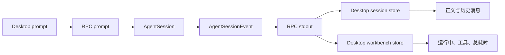
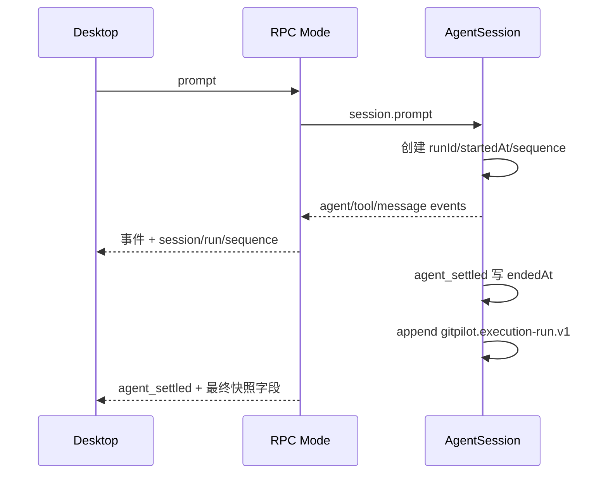
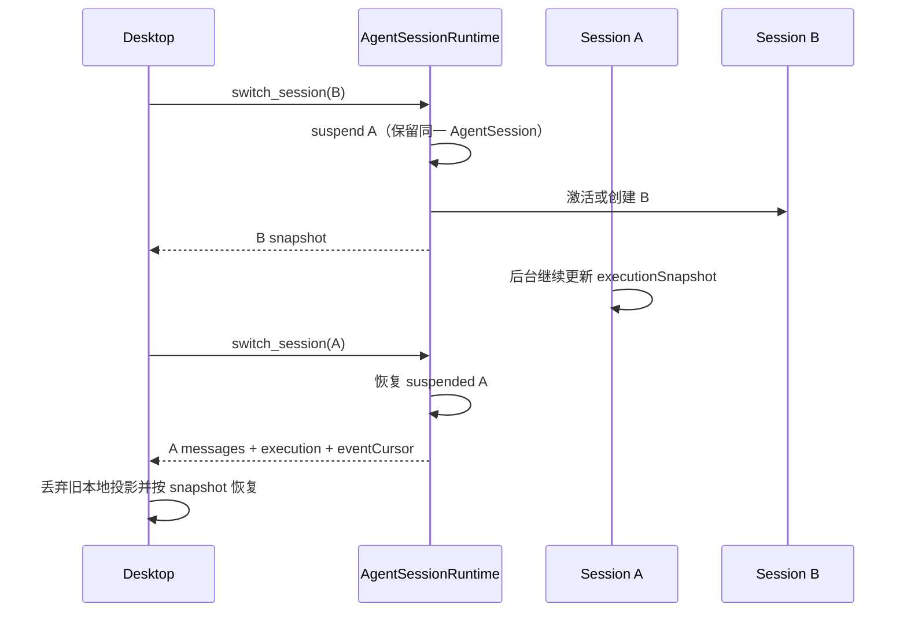

# GitPilot CLI 会话执行快照与 Desktop 恢复技术设计 v1

> 状态：已落地（P0–P2 实施完成，P3 观察期）
>
> 日期：2026-08-04
>
> 决策摘要：CLI Core 是会话执行状态的唯一事实来源；RPC 提供带会话标识、运行标识和事件游标的执行快照；Desktop 只负责展示、交互和兼容旧 sidecar，不再从消息时间戳或局部事件推断真实运行状态。

## 1. 背景

GitPilot Desktop 已通过 `gitpilot --mode rpc` 复用 CLI 的 AgentSession、工具执行、会话历史和扩展能力。当前 CLI 已支持将正在运行的会话保存在 `AgentSessionRuntime.suspendedSessions` 中，用户切换任务时旧 AgentSession 不会被终止，可以继续在后台执行。

现有 RPC 对 Desktop 暴露的会话运行信息仍主要是 `isStreaming`。Desktop 为展示“运行中”“总耗时”、思考、工具步骤和切换恢复，又在 React/Zustand 中维护了第二套执行投影：

- 收到 `message_update`、`tool_execution_*`、`agent_settled` 后更新本地 Workbench；
- 切换任务时重置本地执行状态，避免旧任务步骤污染新任务；
- 切回运行中的任务时，通过历史用户消息时间戳推算 `startedAt`；
- 通过最后正文、工具批次和消息时间戳推断最终总结、执行过程和总耗时。

这些前端逻辑可以解决单次显示问题，但不能成为长期事实来源。任务切走后，RPC 模式会取消旧会话的直接事件订阅；后台 AgentSession 虽继续运行，Desktop 却可能错过工具进度、重试、压缩和最终 `agent_settled`。切回后仅靠历史消息无法准确恢复活动工具、真实结束时间、事件顺序和运行编号，因而会持续出现以下问题：

- 切换任务后“运行中”消失或计时重新从零开始；
- 后台完成的任务总耗时依赖消息时间戳，可能漏掉重试、压缩和队列续跑时间；
- 切回时活动工具、等待确认和思考/正文阶段丢失；
- 旧请求返回、切换期间事件和新会话状态之间存在竞态；
- Desktop 与 CLI 分别维护执行状态机，语义逐渐漂移。

本设计将会话执行生命周期、计时和恢复能力收敛到 CLI Core，并通过向后兼容的 RPC 快照提供给 Desktop。

## 2. 目标与非目标

### 2.1 目标

1. CLI Core 维护每个 AgentSession 的权威执行快照，包括运行编号、状态、阶段、开始/结束时间、活动工具和事件游标。
2. 正在后台执行的 suspended session 持续更新自己的快照，不依赖当前 RPC UI 是否订阅该会话。
3. Desktop 切换、重连或恢复窗口时能够一次取得会话状态、消息和执行快照，不再从消息时间戳猜测运行态。
4. 当前会话实时事件携带 `sessionFile`、`sessionId`、`runId` 和单调递增 `sequence`，Desktop 可以去重并解决切换竞态。
5. 精确记录从用户任务进入执行到 `agent_settled` 的总耗时，包含自动重试、自动压缩和队列续跑。
6. 保留现有 Desktop 展示体验：运行中固定头部、正文/工具交错、完成后折叠到总耗时、展开详情和收起动画仍由 React 负责。
7. 兼容旧 Desktop 和旧 sidecar，支持分阶段升级和快速回滚。

### 2.2 非目标

- 不把 React 样式、分隔线、动画、展开状态或滚动位置下沉到 CLI。
- 不在本期实现通用 `pi.registerRpcMethod()` 扩展框架。
- 不向后台持续推送所有 suspended session 的完整 token 和工具输出；P0/P1 通过摘要轮询和切回快照恢复。
- 不把本地 Desktop 执行快照同步到平台 backend、执行中心或跨设备云端会话。
- 不修改模型调用、工具安全策略、文件权限、确认机制和 Agent 自动重试策略。
- 不要求历史 JSONL 全量迁移；没有精确运行元数据的旧会话继续使用兼容推断。

## 3. 影响范围

### 3.1 模块

| 模块 | 影响 | 说明 |
|---|---|---|
| `gitpilot-cli/src/core/agent-session.ts` | 高 | 维护权威执行快照与事件序号，是实际状态源 |
| `gitpilot-cli/src/core/agent-session-runtime.ts` | 中 | 查询当前和 suspended session 的执行摘要 |
| `gitpilot-cli/src/modes/rpc/` | 中 | 扩展 RPC DTO、切换响应和事件元数据 |
| `gitpilot-desktop/src/rpc/` | 中 | 镜像 RPC 类型、能力协商和兼容解析 |
| `gitpilot-desktop/src/store/` | 中 | 从推断式 Workbench 改为快照投影与事件归并 |
| `gitpilot-desktop/src/components/` | 低 | 继续消费 store，保持现有展示行为 |
| Desktop sidecar 构建与安装 | 中 | CLI 协议变化后必须重编并重新打包 sidecar |
| `docs/` | 低 | 同步 RPC、Desktop 和架构文档 |

### 3.2 不影响

- `backend/` 数据库、权限和平台 API；
- `frontend/`、`frontend-public/`；
- `code-processing/`；
- 平台多 Runtime 的远程执行事件协议。

### 3.3 风险判断

GitNexus 对 `runRpcMode` 的直接调用影响主要集中在 RPC 入口和现有 RPC 测试，符号级结果为低风险；但本方案涉及 CLI Core、RPC 镜像类型、Desktop store 和 sidecar 打包，按跨模块契约变更应整体评估为中等风险。

## 4. 现状与问题分析

### 4.1 当前运行链路



CLI 与 Desktop 同时在归并同一组事件：CLI 负责真正执行，Desktop 又负责解释执行状态。只要 Desktop 全程订阅当前会话，结果通常一致；任务切换或进程重连后，事件链被打断，前端投影便无法完整恢复。

### 4.2 suspended session 已有能力

`AgentSessionRuntime` 已具备正确的后台任务基础：

1. 当前会话仍在运行时，`suspendCurrentIfRunning()` 保存同一个 AgentSession 和 cwd-bound services；
2. 切换到其他任务后，旧 AgentSession 不执行 `dispose()`，继续后台运行；
3. `isSessionStreaming(sessionPath)` 可以读取当前或 suspended session 的真实 `isStreaming`；
4. 切回 suspended session 时直接恢复原 AgentSession 实例。

因此无需重新设计多任务执行容器。缺口在于 AgentSession 没有对外暴露可恢复的结构化运行快照，RPC 的 `list_sessions` 也只返回布尔运行态。

### 4.3 Pi extension 能力与限制

Pi extension 可以监听 `agent_start`、`agent_settled`、`message_update` 和 `tool_execution_*`，也可以通过 `appendEntry()` 持久化扩展数据。但不选择以扩展实现权威执行快照，原因如下：

- `registerCommand()` 的 handler 不返回结构化数据；RPC `execute_command` 会立即返回成功，不能作为快照查询接口；
- `appendEntry()` 是追加式持久化，高频工具进度会造成 JSONL 膨胀；
- extension UI 的 `setStatus` 只有字符串，没有稳定的 session/run/sequence 契约；
- 执行生命周期是所有宿主都需要的核心事实，不应依赖某个可禁用扩展；
- 扩展重载、禁用或第三方覆盖不能影响 Desktop 判断 Agent 是否仍在运行。

扩展可以消费执行快照做通知或业务增强，但不能成为执行状态源。

## 5. 设计原则与职责边界

### 5.1 单一事实来源

CLI Core 负责回答以下问题：

- 哪个 session 正在运行；
- 当前属于哪一次 run；
- run 何时开始、何时真正 settled；
- 当前处于思考、正文、工具、重试、压缩还是等待阶段；
- 哪些工具仍在运行或等待确认；
- Desktop 已消费到哪个事件序号。

Desktop 负责回答以下问题：

- 状态显示成“运行中”还是“总耗时”；
- 中间正文和工具如何排列、折叠和展开；
- 分隔线、字体、颜色和动画；
- 当前用户展开了哪一个步骤；
- 页面滚动和会话切换的视觉反馈。

### 5.2 状态与历史分离

- 执行快照描述“此刻”和最近一次 run 的权威状态；
- Agent messages/session entries 描述可持久化历史；
- 工具完整历史仍以 assistant toolCall、toolResult 和 session entries 为准；
- 快照只保留恢复实时 UI 必需的活动工具与运行摘要，避免重复保存无限增长的执行历史。

### 5.3 兼容优先

新增字段默认可选，旧客户端忽略未知字段；Desktop 只有在 sidecar 宣告能力后才使用新快照。旧 sidecar 继续使用现有前端推断兜底。

## 6. CLI Core 执行快照

### 6.1 核心类型

建议在 `gitpilot-cli/src/core/agent-session.ts` 或独立的 `agent-execution-state.ts` 定义运行时中性类型：

```ts
export type AgentExecutionStatus =
  | "idle"
  | "running"
  | "completed"
  | "failed"
  | "stopped";

export type AgentExecutionPhase =
  | "preparing"
  | "thinking"
  | "responding"
  | "tool"
  | "retrying"
  | "compacting"
  | "queued_continuation"
  | "waiting_confirmation"
  | "settling"
  | "idle";

export interface AgentExecutionToolSnapshot {
  toolCallId: string;
  toolName: string;
  status: "running" | "waiting" | "succeeded" | "failed";
  args?: unknown;
  partialResult?: unknown;
  result?: unknown;
  isError?: boolean;
  startedAt: number;
  endedAt?: number;
  sequence: number;
}

export interface AgentExecutionSnapshot {
  runId: string | null;
  status: AgentExecutionStatus;
  phase: AgentExecutionPhase;
  startedAt?: number;
  endedAt?: number;
  updatedAt: number;
  sequence: number;
  rootUserTimestamp?: number;
  activeTools: AgentExecutionToolSnapshot[];
  lastError?: string;
}
```

约束：

- `runId` 在一次用户执行开始时生成，自动重试、自动压缩和队列 continuation 仍属于同一个 run；
- `startedAt` 在 `_isAgentRunActive` 从 false 变为 true 的同一业务边界写入；
- `endedAt` 只在 `agent_settled`、明确 abort 或不可恢复失败时写入；
- 单个工具失败不直接把整个 run 标记为 failed；最终状态以 run 是否还能继续和 settled outcome 为准；
- `sequence` 对单个 session 单调递增，任何影响执行展示的状态变化都必须递增；
- `activeTools` 支持并行工具，不能简化成单个 `activeTool`。

### 6.2 状态转换

| 输入事件/动作 | status | phase | 关键更新 |
|---|---|---|---|
| 新 prompt 开始 | `running` | `preparing` | 生成 `runId`，写 `startedAt` |
| `thinking_delta` | `running` | `thinking` | 更新 `updatedAt/sequence` |
| `text_delta` | `running` | `responding` | 更新 `updatedAt/sequence` |
| `tool_execution_start` | `running` | `tool` | 新增活动工具 |
| `tool_execution_update` | `running` | `tool` | 替换该工具 partialResult |
| `tool_execution_end` | `running` | `tool` 或 `settling` | 工具转终态并从 active 集合移除 |
| `auto_retry_start` | `running` | `retrying` | 保留同一 `runId` |
| `compaction_start` | `running` | `compacting` | 保留同一 `runId` |
| `queue_update` 有后续内容 | `running` | `queued_continuation` | 等待下一轮或继续当前 run |
| 扩展等待用户输入 | `running` | `waiting_confirmation` | 保留 run 与计时 |
| `agent_settled` | `completed/failed/stopped` | `idle` | 写 `endedAt`，清空 activeTools |

`agent_end` 和 `turn_end` 不能结束整个 run。它们只代表低层 Agent run 或模型 turn 结束，后续仍可能重试、压缩或消费队列。

### 6.3 快照更新位置

权威投影必须在 AgentSession 内部事件链更新，而不是只在 `rpc-mode.ts` 的 `session.subscribe()` 中更新。这样即使 RPC 已切换到其他会话，suspended AgentSession 仍会处理自己的事件并更新快照。

建议路径：

1. `_runAgentPrompt()` 创建或恢复当前 run；
2. `_handleAgentEvent` / `_emitExtensionEvent` 同一事件边界更新 phase、工具和 sequence；
3. `_emitAgentSettled()` 写终态和 endedAt；
4. `abort()` 或不可恢复错误路径写 stopped/failed；
5. 暴露只读 `get executionSnapshot()`，返回不可被调用方修改的副本。

### 6.4 已完成运行的持久化

内存快照可以解决 suspended session，但应用退出后仍需要精确总耗时。每次 run settled 时，CLI Core 向 SessionManager 追加一条低频 custom entry：

```ts
interface ExecutionRunEntryV1 {
  version: 1;
  runId: string;
  status: "completed" | "failed" | "stopped";
  startedAt: number;
  endedAt: number;
  rootUserTimestamp?: number;
  lastSequence: number;
}
```

推荐 `customType`：`gitpilot.execution-run.v1`。

只在 run 结束时追加一次，不持久化 token 增量和工具 partialResult。工具详情继续由标准消息和 toolResult 恢复，避免重复数据和 JSONL 膨胀。

旧会话没有该 entry 时，Desktop 或 CLI 历史转换可以继续使用首尾消息时间戳作为降级值，并标记为 `durationSource: "inferred"`。

## 7. AgentSessionRuntime 查询能力

在 `AgentSessionRuntime` 增加只读查询：

```ts
getSessionExecutionSnapshot(sessionPath: string): AgentExecutionSnapshot | undefined;
getSessionExecutionSummary(sessionPath: string): AgentExecutionSummary | undefined;
```

查询规则：

1. 目标是当前 session，直接读取 `this.session.executionSnapshot`；
2. 目标在 `suspendedSessions`，读取保存的同一 AgentSession 实例；
3. 目标未加载，只能从 SessionManager 最后一条 `gitpilot.execution-run.v1` 恢复终态摘要；
4. 不为仅查看列表而创建完整 AgentSession runtime，避免模型、扩展和 cwd services 的额外开销。

`list_sessions` 只需要 summary，不返回活动工具参数和输出。

## 8. RPC 契约

### 8.1 能力协商

`get_state` 增加：

```ts
interface RpcSessionState {
  // 保留现有字段
  rpcCapabilities?: string[];
  execution?: RpcSessionExecutionSnapshot;
}
```

v1 能力编码：

- `session_execution_snapshot_v1`
- `session_event_metadata_v1`
- `switch_session_snapshot_v1`

Desktop 不按版本号硬编码行为，只按能力字段启用对应链路。

### 8.2 会话列表摘要

`SessionListItem` 保留 `isStreaming`，新增可选字段：

```ts
interface RpcSessionExecutionSummary {
  runId: string | null;
  status: AgentExecutionStatus;
  phase: AgentExecutionPhase;
  startedAt?: number;
  endedAt?: number;
  updatedAt: number;
  sequence: number;
  activeToolCount: number;
  activeToolName?: string;
}

interface SessionListItem {
  // 保留现有字段
  isStreaming?: boolean;
  execution?: RpcSessionExecutionSummary;
}
```

`isStreaming` 在兼容期由 `execution.status === "running"` 派生，旧 Desktop 无需修改即可继续显示侧栏运行标记。

### 8.3 原子会话快照

新增统一 DTO：

```ts
interface RpcDesktopSessionSnapshot {
  session: RpcSessionState;
  execution: RpcSessionExecutionSnapshot;
  messages: AgentMessage[];
  eventCursor: number;
}
```

新增命令：

```json
{"type":"get_session_snapshot"}
```

用途：应用启动、sidecar 重连和显式刷新当前任务。

`switch_session` 成功响应增加可选 `snapshot`：

```ts
{
  cancelled: boolean;
  snapshot?: RpcDesktopSessionSnapshot;
}
```

新 Desktop 优先直接消费 `switch_session.data.snapshot`，避免当前的 `switch_session -> get_state -> get_messages` 多请求竞态。旧 sidecar 没有 snapshot 时继续执行原链路。

### 8.4 实时事件元数据

RPC 输出的 AgentSessionEvent 增加传输层元数据，不污染 Core 原始事件类型：

```ts
interface RpcSessionEventMetadata {
  sessionFile?: string;
  sessionId: string;
  runId?: string;
  sequence: number;
  emittedAt: number;
}

type RpcAgentSessionEvent = AgentSessionEvent & RpcSessionEventMetadata;
```

兼容规则：

- 保留事件原有 `type`，不新增外层 envelope，旧客户端可忽略额外字段；
- `runId` 仅在 run 处于 `running` 时附带：settle 之后快照管理器仍保留上一轮 `runId`，空闲期事件（如 auto-plan 在 input 阶段追加的 `entry_appended`）必须省略 `runId`，否则 Desktop 在 `beginExecution` 重置后会误把旧 `runId` 绑定为当前 run，导致下一轮事件全部被当作旧 run 丢弃（同会话第二次提问执行过程消失的根因）；
- `agent_settled` 是终态边界事件，例外保留刚结束 run 的 `runId` 供 Desktop 收口对齐；
- sequence 只在同一 session 内比较，且单调递增不回退（空闲期事件不推进游标）；
- Desktop 必须同时比较 `sessionFile + runId + sequence`，不能跨 session 直接比较序号；
- Desktop 本地 run 已终态且事件序号超过已应用游标时，允许事件绑定新 run 并重置瞬时执行态：覆盖扩展确认后 `sendUserMessage` 直接开启新 run 等没有 `beginExecution` 边界的场景；
- 切换期间先缓存目标 session 的事件；收到 snapshot 后丢弃 `sequence <= eventCursor` 的事件，再按序应用剩余事件。

### 8.5 后台事件策略

P0/P1 不向 Desktop 推送所有后台会话的完整事件，避免多个任务的 token 和工具输出同时冲击 IPC 与 UI。后台状态通过以下方式可见：

- `list_sessions` 低频刷新 execution summary；
- 系统通知只在 settled/failed/waiting_confirmation 等关键节点发送；
- 用户切回任务后使用原子 snapshot 恢复完整当前态。

未来如需后台详情实时面板，可增加带 session 过滤的订阅命令，不在 v1 范围内。

## 9. 关键流程

### 9.1 正常执行



### 9.2 运行中切走再切回



### 9.3 后台任务已经完成

1. Session A 在后台收到 `agent_settled`；
2. A 的内存快照写 `endedAt/status`，并追加一条 settled custom entry；
3. `list_sessions` 下一次刷新显示 A 已完成，不再展示运行标记；
4. 用户切回 A 时，snapshot 返回精确总耗时；
5. Desktop 将中间正文、工具记录和文件变化折叠到“总耗时”，最终正式总结留在主正文。

### 9.4 Desktop 或 sidecar 重连

1. Desktop 重新建立 bridge；
2. 调用 `get_session_snapshot`；
3. CLI 从当前 AgentSession 内存快照或 settled custom entry 返回状态；
4. Desktop 清理无法关联到当前 `sessionFile/runId` 的旧 Workbench 数据；
5. 后续只应用 sequence 大于 eventCursor 的事件。

## 10. Desktop 状态与展示

### 10.1 Store 调整

`session.ts`：

- 会话切换以 RPC snapshot 为准；
- `isStreaming` 兼容字段继续保留，但由 snapshot status 派生；
- 移除新协议下通过最后用户消息时间戳恢复 startedAt 的主路径；
- 旧 sidecar 下保留 `getRunningExecutionSeed()` 等兼容逻辑。

`workbench.ts`：

- 增加 `hydrateExecutionSnapshot(snapshot)`；
- 实时事件必须通过 session/run/sequence 校验后归并；
- 切换任务时不再无条件创建假的 running run；
- Desktop 本地只保留 UI 选择状态，例如 selectedStepId、展开状态和布局偏好。

### 10.2 组件边界

以下行为继续留在 React：

- 顶部“运行中 N秒”与“总耗时 N秒”；
- 只有顶部状态行显示分隔线；
- 中间正文、思考、read/bash、改动文件的交错展示；
- 完成后收进总耗时并支持展开；
- 运行中到总耗时的收起动画；
- reduced-motion、键盘可访问性和滚动定位。

组件不得自行决定 run 是否结束，也不得用工具失败或 `turn_end` 替代 `agent_settled`。

### 10.3 Duration 来源

建议在 UI 元数据中保留来源标记：

```ts
type ExecutionDurationSource = "snapshot" | "persisted" | "inferred";
```

- `snapshot`：当前/后台内存快照，精确；
- `persisted`：`gitpilot.execution-run.v1`，精确；
- `inferred`：旧会话消息时间戳，只作兼容，不用于判断运行状态。

## 11. 方案取舍

### 11.1 方案 A：继续在 Desktop 修补

优点：改动小、见效快。

缺点：无法恢复漏掉的后台事件；运行状态机重复；耗时与阶段只能推断；每个新边界都会继续增加前端补丁。

结论：仅保留为旧 sidecar 兼容路径，不作为目标架构。

### 11.2 方案 B：使用 Pi extension + custom entry

优点：事件监听能力完整，不需要直接改 AgentSession 核心事件类型。

缺点：没有结构化扩展 RPC；高频追加会膨胀 JSONL；扩展可禁用/重载；不适合作为所有宿主的基础运行事实。

结论：不采用。

### 11.3 方案 C：先实现通用 `pi.registerRpcMethod()`

优点：未来第三方扩展可以暴露结构化 RPC 能力。

缺点：需要设计命名空间、权限、schema、超时、序列化、冲突和兼容治理，显著扩大本次范围；执行生命周期仍应由 Core 维护。

结论：本期不做。未来出现两个以上明确的结构化扩展 RPC 场景时另立设计。

### 11.4 方案 D：CLI Core 快照 + RPC 契约

优点：事实源唯一；天然覆盖 suspended session；可精确计时和恢复；Desktop 更简单；其他 RPC 客户端也可复用。

代价：需要同步修改 CLI、RPC、Desktop 和 sidecar 包，并补充跨模块测试。

结论：采用。

## 12. 兼容、灰度与回滚

### 12.1 向后兼容

- RPC 新字段全部可选；
- 保留 `isStreaming`；
- `switch_session.snapshot` 可选；
- 旧 Desktop 忽略 execution 和 event metadata；
- 新 Desktop 检测不到 capability 时继续使用现有推断逻辑。

### 12.2 Sidecar 版本错配

Desktop 启动后必须读取 `rpcCapabilities`，不得仅根据应用版本假设 sidecar 能力。若资源目录中 sidecar 未更新：

- 不调用 `get_session_snapshot`；
- 不要求事件 sequence；
- 显示一次可诊断日志，记录 Desktop 版本、sidecar 版本和能力列表；
- 继续使用旧链路，不阻断普通对话。

### 12.3 灰度开关

Desktop 本地能力开关：`sessionExecutionSnapshotV1`，默认由 capability 自动开启，调试构建允许手工关闭以验证回退路径。

CLI 不增加环境变量开关；快照维护是只读运行投影，不改变 Agent 行为。RPC 输出新字段可通过 capability 兼容旧客户端。

### 12.4 回滚

- 回滚 Desktop：旧版本忽略 RPC 新字段；
- 回滚 sidecar：新 Desktop 自动回退前端推断；
- settled custom entry 是通用 custom entry，旧 CLI 会忽略，不影响会话上下文；
- 不删除已写入的 v1 entry，后续版本继续识别。

## 13. 风险与缓解

| 风险 | 级别 | 缓解措施 |
|---|---|---|
| sequence 与事件输出顺序不一致 | 中 | 在 AgentSession 更新快照和生成事件元数据时使用同一同步边界 |
| 并行工具被单工具字段覆盖 | 中 | snapshot 使用 `activeTools[]`，按 toolCallId 更新 |
| switch response 与实时事件交错 | 中 | snapshot 携带 eventCursor，Desktop 缓存并按序重放 |
| settled entry 与消息落盘顺序异常 | 中 | 在 `agent_settled` 最终边界追加，测试正常、失败、abort、retry、compaction |
| JSONL 历史增长 | 低 | 每个 run 仅一条 summary entry，不保存 delta/partialResult |
| CLI Core 状态修改影响 TUI/print/json | 中 | 快照为只读附加投影，不改变已有事件和展示；运行全模式测试 |
| 安装包仍携带旧 sidecar | 中 | 能力协商、构建产物校验和安装态 smoke test |
| Desktop 双路径长期并存 | 中 | P3 设置移除旧推断的版本门槛和遥测观察期 |

## 14. Harness 与验证

### 14.1 CLI Core 单元测试

- prompt 创建 runId 和 startedAt；
- thinking/text/tool/retry/compaction/queue phase 转换；
- 并行工具按 toolCallId 独立更新；
- 单工具失败不提前结束 run；
- `turn_end`、`agent_end` 不写 endedAt；
- `agent_settled` 精确写 endedAt 并追加一条 v1 entry；
- abort、不可恢复失败和 extension 等待确认；
- suspended session 切走后继续更新，切回仍是同一 runId 和 startedAt。

### 14.2 RPC 契约测试

- `get_state` 返回 capability 和当前 execution；
- `list_sessions` 同时返回当前与 suspended session summary；
- `switch_session` 返回目标会话原子 snapshot；
- `get_session_snapshot` 的 session/messages/execution 来自同一会话；
- 实时事件包含 session/run/sequence，旧字段不变；
- 未知命令 id、JSONL 帧、背压和现有 prompt response 语义不回归。

### 14.3 Desktop 测试

- snapshot hydrate 后立即显示运行中和原始累计耗时；
- 切换 A/B/A 不串步骤、不丢运行态；
- sequence 去重、乱序缓存和旧 run 事件拒绝；
- 后台完成后切回显示精确总耗时；
- 中间正文/工具折叠及动画保持；
- capability 缺失时旧 sidecar 兼容路径仍可用。

### 14.4 构建与安装态验证

```powershell
cd gitpilot-cli
npm.cmd test
npm.cmd run build

cd ..\gitpilot-desktop
npm.cmd test
npm.cmd run build
npm.cmd run check:ui-boundaries

cd ..
python scripts/check_encoding.py
git diff --check
```

还必须重编 Desktop 使用的 RPC sidecar，并在真实 Tauri WebView 中验证：

1. 启动长任务 A；
2. 切到任务 B；
3. 确认 A 在侧栏保持运行摘要；
4. 切回 A，计时与活动工具连续；
5. 再切走等待 A 完成；
6. 切回 A，显示精确总耗时且中间过程可展开。

静态测试和构建不能替代该原生 Desktop 验收。

## 15. 落地计划

### P0：类型与 Core 投影

1. 定义 execution snapshot、phase、tool snapshot 和 settled entry v1；
2. 在 AgentSession 内部维护 runId、时间和 sequence；
3. 覆盖正常、失败、abort、retry、compaction 和并行工具测试；
4. 不修改 Desktop 行为。

交付物：CLI Core 可查询权威快照，历史 run 有精确 settled summary。

### P1：RPC 快照与能力协商

1. 扩展 CLI RPC types、mode 和 typed client；
2. `get_state/list_sessions` 返回 execution；
3. 增加 `get_session_snapshot`；
4. `switch_session` 返回可选 snapshot；
5. 实时事件增加 session/run/sequence；
6. 更新 `gitpilot-cli/docs/rpc.md`。

交付物：任何 RPC 客户端可以可靠恢复当前或 suspended session。

### P2：Desktop 迁移

1. 同步 Desktop RPC 类型；
2. session store 使用 switch snapshot；
3. workbench store 增加 hydrate 和 sequence guard；
4. 现有消息时间戳推断降级为兼容路径；
5. 保持 ChatView/ExecutionActivity 的视觉行为不变；
6. 重编并打包 Windows sidecar。

交付物：任务切换、后台完成和重连不再丢运行态。

### P3：观察与清理

1. 记录 snapshot/compat 路径命中情况；
2. 完成安装态和长任务切换验证；
3. 至少经过一个稳定发布周期后，评估删除前端 startedAt 推断；
4. 更新 `docs/architecture.md` 和 Desktop 主设计文档的已落地状态。

> 落地说明：第 2 项的“长任务 A/B/A 切换”已用 `gitpilot-cli/test/e2e-aba-smoke.test.ts` 以 headless 方式驱动真实重编 sidecar 二进制 + 本地慢速流式服务完成验证（启动长任务 A → 切到 B 侧栏保持运行摘要 → 切回 A runId/startedAt 连续 → 再切走等 A 完成 → 切回 A 显示精确总耗时且消息历史可展开）。该用例覆盖 §14.4 第 6 步的核心断言；Tauri WebView GUI 层（Rust IPC + React 渲染）是快照数据的透传层，不影响快照逻辑，发布前建议在打包应用中做一次人工 GUI 确认。

## 16. 计划影响文件

### CLI

- `gitpilot-cli/src/core/agent-session.ts`
- `gitpilot-cli/src/core/agent-session-runtime.ts`
- 可选新增 `gitpilot-cli/src/core/agent-execution-state.ts`
- `gitpilot-cli/src/modes/rpc/rpc-types.ts`
- `gitpilot-cli/src/modes/rpc/rpc-mode.ts`
- `gitpilot-cli/src/modes/rpc/rpc-client.ts`
- `gitpilot-cli/docs/rpc.md`
- `gitpilot-cli/test/suite/agent-session-runtime.test.ts`
- `gitpilot-cli/test/agent-session-runtime-events.test.ts`
- `gitpilot-cli/test/rpc*.test.ts`

### Desktop

- `gitpilot-desktop/src/rpc/types.ts`
- `gitpilot-desktop/src/rpc/bridge.ts`
- `gitpilot-desktop/src/store/session.ts`
- `gitpilot-desktop/src/store/workbench.ts`
- `gitpilot-desktop/src/components/ChatView.tsx`
- `gitpilot-desktop/src/components/ExecutionActivity.tsx`
- 对应 Vitest 测试
- sidecar build/resource 配置与产物校验脚本

### 文档

- `docs/design-docs/index.md`
- 实施完成后更新 `docs/architecture.md`
- 实施完成后更新 `docs/design-docs/gitpilot-desktop-technical-design-v1.md`

## 17. 验收标准

必须同时满足以下条件，才能认为设计已完成落地：

1. CLI 是 startedAt、endedAt、runId、phase 和 activeTools 的唯一事实来源；
2. 运行中任务切换 A/B/A 后，runId 和 startedAt 不变；
3. 后台任务完成后，Desktop 无需收到后台完整事件也能恢复精确总耗时；
4. Desktop 不再在新协议主路径从消息时间戳判断运行状态；
5. snapshot 与实时事件通过 session/run/sequence 可去重、可拒绝旧事件；
6. 旧 Desktop、旧 sidecar 和旧 JSONL 会话均有明确兼容路径；
7. CLI、Desktop、sidecar 构建和原生安装态切换冒烟全部通过；
8. 现有运行中/总耗时、过程折叠、正文展示和动画体验不回退。

## 18. 待确认问题

以下问题建议在 P0 代码实施前评审确认：

1. `runId` 使用 UUID，还是使用 `sessionId + startedAt + counter` 的可读组合；默认建议 UUID。
2. settled custom entry 是否保存 `rootUserEntryId`。若 SessionManager 在 prompt 开始边界能稳定取得 entry id，建议保存；否则 v1 使用 `rootUserTimestamp`。
3. `failed` 最终状态的判定来源。默认建议只在不可恢复错误导致本次 run settled 时标记 failed，单工具失败仍保持 running。
4. waiting confirmation 是否由 Core 直接感知 extension UI pending request；默认建议 RPC/Extension UI bridge 将等待状态回写到当前 AgentSession snapshot。
5. 是否在 P1 就发送后台 settled 通知；默认建议发送轻量通知，但不推送后台 token 和完整工具事件。
