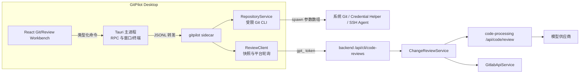
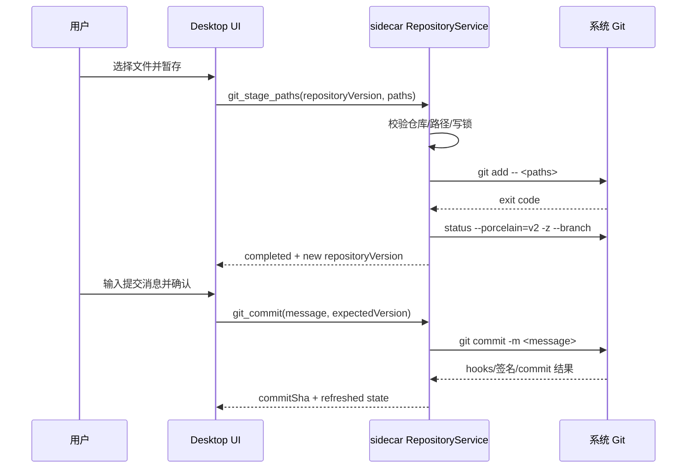
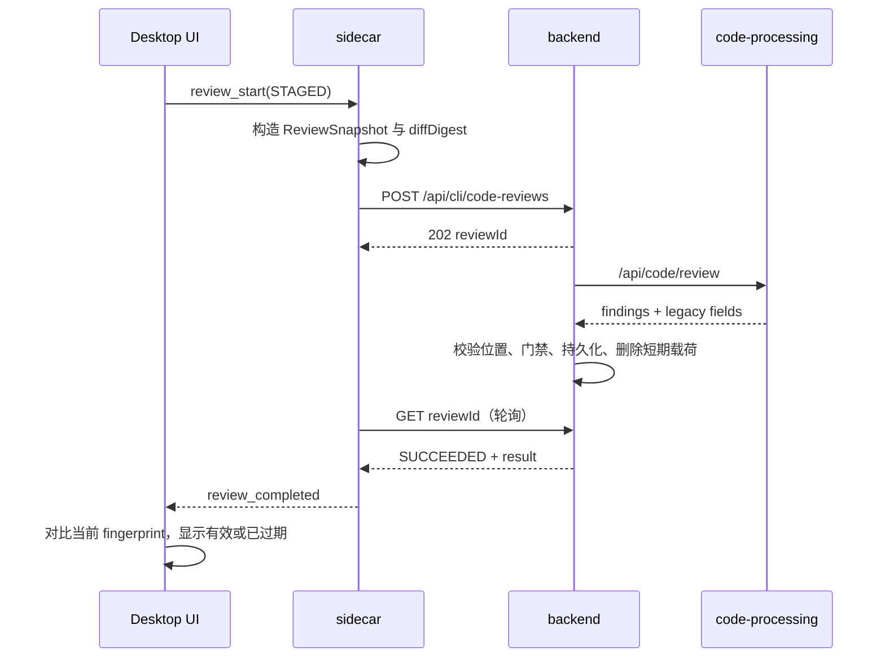

# GitPilot Desktop Git 与代码审查工作台技术设计 v1

> 状态：**方案完成，尚未实施**  
> 适用范围：`gitpilot-desktop`、`gitpilot-cli` sidecar、backend、`code-processing`  
> OpenSpec：`openspec/changes/add-gitpilot-desktop-git-review-workbench/`

## 1. 结论摘要

GitPilot Desktop 的 Git 与代码审查能力采用“两条链路、一个工作台”的方案：

- **本地 Git 链路**：由 gitpilot sidecar 内新增的受限 `RepositoryService` 调用系统 Git，提供状态、Diff、暂存、提交、分支和安全远程同步。该链路不依赖平台，离线可用。
- **平台审查链路**：Desktop 生成不可变 `ReviewSnapshot`，通过现有 `gpt_` 身份提交给 backend；backend 复用并泛化现有 `CodeReviewClientService -> code-processing /api/code/review` 链路，负责模型治理、结构化 finding、历史复审、用量、权限和 GitLab 发布。
- **统一 Desktop 体验**：复用现有三栏 shadcn 工作台。左侧在“任务/源代码管理”间切换，中心区展示对话或 Diff，右侧在“执行/审查”间切换，底部终端保持独立。

关键安全结论：React 不获得 Git、Shell、文件系统、GitLab Token 或模型密钥；Rust 主进程不承载 Git 业务；AI 审查不会自动修改、提交、Push、批准或合并代码。

## 2. 背景与现状

### 2.1 Desktop 当前边界

当前 Desktop 已具备：

- Tauri 2 主进程管理窗口、托盘、sidecar 和受限 PowerShell 终端。
- React 19 + Zustand + shadcn 工作台，通过 `rpc_send` 消费 sidecar JSONL/RPC。
- 项目/任务、会话、对话、Agent 执行检查器、代码卡片、终端和平台登录。
- `session.cwd` 作为 Agent 和终端的当前项目上下文。

当前不具备结构化 Git 状态、变更列表、分支、提交、远程同步和独立代码审查工作台。用户只能在应用内终端手工运行 Git，UI 无法稳定理解命令结果，也无法把某个确定 Diff 作为审查快照。

### 2.2 现有审查链路

平台已有面向 GitLab 自动合并的审查能力：

```text
GitlabManagementService
  -> GitlabApiService 读取 MR 与 changes
  -> CodeReviewClientService.reviewMergeRequest(...)
  -> POST code-processing /api/code/review
  -> ReviewResponse(approved, issues, reviewMarkdown, 历史问题状态)
  -> 自动合并最终门禁与日志
```

该链路已经解决模型配置、供应商调用、用量回传、审查严格度和历史问题，但仍存在三项缺口：

1. 输入对象与 GitLab MR 强耦合，不能直接审查工作区、暂存区或任意分支比较。
2. `issues` 是字符串列表，缺少严重级别、类别、文件、行号、证据和稳定指纹。
3. 同步 HTTP 调用适合自动合并内部流程，不适合 Desktop 的取消、进度、过期检测和历史浏览。

### 2.3 设计原则

- 确定性 Git 操作与生成式 AI 审查分离。
- 本地 Git 不依赖平台；平台不可用只影响 AI 审查和 MR 能力。
- 每份审查结果必须能回答“审的是哪一份代码”。
- 高风险 Git 操作默认不开放，而不是依赖提示词约束。
- 审查、修复、暂存、提交、Push、批准、合并是独立动作。
- 复用既有三进程和平台审查能力，不在 Desktop 内另建模型直连。

## 3. 目标与范围

### 3.1 v1 目标

- 查看仓库、分支、upstream、ahead/behind、冲突和文件状态。
- 查看工作区、暂存区、分支比较和 MR 的按文件 Diff。
- 暂存、取消暂存、提交、创建/切换分支、Fetch、仅快进 Pull、普通 Push。
- 对 WORKTREE、STAGED、BRANCH、MERGE_REQUEST 四类范围发起 AI 审查。
- 展示结构化 finding、覆盖率、未覆盖范围、历史状态和过期状态。
- 把 finding 显式交给 Agent 修复，或显式发布为 GitLab MR 总评。
- 对本地载荷、权限、模型用量、发布与用户反馈形成审计。

### 3.2 v1 不做

- Monaco/通用编辑器、完整提交图谱、交互式 rebase 和高级 Git GUI。
- force push、`reset --hard`、`clean -fd`、rebase、cherry-pick、stash 管理、强制删分支。
- 自动解决冲突、自动跳过 hooks、自动关闭签名、托管 SSH/GPG 私钥。
- 因 AI 返回 `approved=true` 自动批准或合并 MR。
- GitHub/Gitee 远程发布；领域模型预留 provider，首版只接现有 GitLab。

## 4. 总体架构



### 4.1 模块职责

| 模块 | 新增职责 | 禁止承担 |
|---|---|---|
| React | Git/审查 UI、确认、过滤、过期提示、状态展示 | 任意 Git/Shell、平台密钥、GitLab Token |
| Tauri Rust | 继续转发 RPC，维持窗口/终端/sidecar 生命周期 | Git 解析、审查业务、平台调用 |
| sidecar | RepositoryService、仓库观察、ReviewSnapshot、平台 ReviewClient | 模型供应商 key、GitLab 项目 Token |
| backend | scope、所有权、短期载荷、审查编排、结果/反馈/发布审计 | 保存本地绝对路径和长期完整 Diff |
| code-processing | 通用结构化审查、供应商兼容、用量回传 | 用户权限和 GitLab 发布决策 |

## 5. Desktop 信息架构与交互

### 5.1 复用现有三栏工作台

```text
┌────────────────────────────────────────────────────────────────────┐
│ GitPilot / 项目 / 当前分支 / 平台与 sidecar 状态                    │
├────────────────┬────────────────────────────────┬──────────────────┤
│ [任务][源代码] │ [对话] [Diff: service.ts]      │ [执行] [审查]    │
│                │                                │                  │
│ 仓库/分支       │ Unified / Split Diff           │ 结论与覆盖率      │
│                │                                │                  │
│ 已暂存 3       │ 行号  旧代码  |  新代码         │ High 2 / Med 1   │
│ 未暂存 5       │                                │ Finding 列表      │
│ 未跟踪 1       │ 行级审查锚点                    │ 历史/反馈/发布    │
├────────────────┴────────────────────────────────┴──────────────────┤
│ 终端 / 输出                                                   状态栏│
└────────────────────────────────────────────────────────────────────┘
```

- 左侧不另起新窗口：项目级模式切换为“任务/源代码管理”。
- 中心区保留对话；选择变更文件时进入 Diff tab，关闭后回到对话。
- 右侧在既有执行检查器上增加“审查”tab，不混淆工具执行和模型 finding。
- 800–959px 时源代码管理和审查使用现有 Sheet；960px 以上恢复三栏。

### 5.2 高频交互

1. 选择项目后自动探测 Git 仓库；非仓库不影响对话和终端。
2. 点击文件按需读取 Diff，不一次把全仓 Diff 送进 WebView。
3. 暂存/取消暂存按明确路径执行，完成后刷新并提供反向动作。
4. 提交前显示文件数、路径摘要、提交消息与 hooks/签名说明。
5. 切分支、Pull、Push 必须确认；冲突只展示阻断和处理入口。
6. 发起审查前展示范围、base/head、文件数、字节数、截断和隐私说明。
7. 点击 finding 跳转 Diff 行；无法定位的 finding 单独标为“未定位”。
8. “交给 Agent 修复”只填充结构化指令，不直接修改或发送提交。
9. “发布到 MR”单独确认，显示目标仓库、MR、SHA 和幂等发布状态。

## 6. Sidecar Git 设计

### 6.1 RepositoryService

建议目录：

```text
gitpilot-cli/src/core/git/
├─ repository-service.ts
├─ git-process.ts
├─ command-policy.ts
├─ repository-lock.ts
├─ porcelain-v2.ts
├─ diff-parser.ts
├─ remote-parser.ts
├─ review-snapshot.ts
└─ __tests__/
```

`git-process.ts` 只接受内部构造的 `GitInvocation`：

```ts
interface GitInvocation {
  cwd: string;
  args: readonly string[];
  operationId: string;
  readOnly: boolean;
  timeoutMs: number;
}
```

实现约束：

- `spawn(gitExecutable, args, { cwd, shell: false })`，不得拼接命令字符串。
- 环境固定 `GIT_OPTIONAL_LOCKS=0` 只用于只读 status/diff 查询；写操作不设置。
- 禁止请求方传递 `-c`、`--exec-path`、alias 或任意额外 Git 参数。
- 路径参数统一置于 `--` 之后，并先验证属于当前仓库。
- stdout/stderr 设置字节上限；超限时终止进程并返回 `OUTPUT_LIMIT_EXCEEDED`。
- 取消先发送温和终止，超时后再结束进程；无论结果如何都重新读取状态。

### 6.2 Git RPC

| 命令 | 作用 | 副作用/确认 |
|---|---|---|
| `git_get_state` | 仓库、分支、upstream、文件状态 | 无 |
| `git_get_diff` | WORKTREE/STAGED/BRANCH 单文件或分页 Diff | 无 |
| `git_get_log` | 分页提交历史 | 无 |
| `git_list_branches` | 本地/远程分支 | 无 |
| `git_get_remote_context` | 规范化 host/projectPath | 无 |
| `git_stage_paths` | 暂存明确路径 | 可反向，无二次确认 |
| `git_unstage_paths` | 取消暂存明确路径 | 可反向，无二次确认 |
| `git_commit` | 提交 index | 有，必须确认 |
| `git_create_branch` | 创建并可选切换 | 有，必须确认 |
| `git_switch_branch` | 切换分支 | 有，必须确认 |
| `git_fetch` | 更新 remote refs | 远程读，确认一次可记忆 |
| `git_pull_ff_only` | 仅快进更新当前分支 | 有，必须确认 |
| `git_push` | 普通推送当前分支 | 有，必须确认 |

事件统一为：

```text
git_operation_started
git_operation_progress
git_operation_completed
git_operation_failed
git_operation_cancelled
git_state_changed
```

每个响应都带 `repositoryId`、`repositoryVersion` 和 `operationId`。项目切换后，旧仓库的晚到响应不能覆盖新仓库状态。

### 6.3 解析协议

- 状态：`git status --porcelain=v2 -z --branch`。
- 工作区 Diff：`git diff --no-ext-diff --unified=3 -- <path>`。
- 暂存 Diff：`git diff --cached --no-ext-diff --unified=3 -- <path>`。
- 分支比较：先取 `merge-base(base, head)`，再读 `base...head`。
- 路径和 rename/copy 使用 NUL 协议，不按空格拆分。
- 设置 `--no-color`，不解析本地化错误作为状态；失败使用退出码和稳定错误分类。

### 6.4 命令安全矩阵

| 能力 | v1 | 原因 |
|---|---:|---|
| stage / unstage / commit | 是 | 高频、范围明确、可恢复 |
| create / switch branch | 是 | 高频；覆盖本地变更时由 Git 阻断 |
| fetch / pull --ff-only / push | 是 | 限制冲突和历史改写 |
| force push / delete refspec | 否 | 可能破坏远程历史 |
| reset --hard / clean | 否 | 直接丢失本地数据 |
| merge / rebase / cherry-pick | 否 | 需要复杂冲突与中间态管理 |
| 自动解冲突 | 否 | 不应由 UI 隐式写代码 |

### 6.5 状态刷新与大仓库

- Git 工作台可见时观察 `.git/HEAD`、`.git/index`、refs 和工作区变化，500ms 去抖。
- 完整 status 最快每 2 秒一次；观察不可用时退化为 5 秒轮询。
- 自身写操作完成后立即强制刷新，不等待 watcher。
- 超过 2,000 个变更文件进入摘要/分页模式。
- Diff 按文件懒加载；默认单文件 1MB、单次审查 5MB 软限制，硬限制由配置确定。
- 二进制文件不读取内容，只返回路径、状态和大小。

## 7. ReviewSnapshot 与审查语义

### 7.1 审查范围

| source | base | head/变化 | 典型用途 |
|---|---|---|---|
| WORKTREE | HEAD | 未暂存 + 未跟踪的可读文本 | 提交前早期检查 |
| STAGED | HEAD | index | 提交前最终检查 |
| BRANCH | merge-base(base, head) | 当前或选定 head | 合并前分支检查 |
| MERGE_REQUEST | GitLab diff_refs.base_sha | MR head SHA | 平台协作与发布 |

### 7.2 快照结构

```ts
interface ReviewSnapshot {
  source: 'WORKTREE' | 'STAGED' | 'BRANCH' | 'MERGE_REQUEST';
  repoInstanceId: string;
  remoteIdentity?: { provider: 'GITLAB'; host: string; projectPath: string };
  mergeRequestIid?: number;
  baseRef?: string;
  baseSha: string;
  headRef?: string;
  headSha?: string;
  worktreeFingerprint?: string;
  diffDigest: string;
  files: ReviewSnapshotFile[];
  coverage: ReviewCoverage;
}
```

- `repoInstanceId` 为安装级盐值与规范化本地路径的哈希，不上传绝对路径。
- WORKTREE/STAGED 无法只靠 commit SHA 表达，必须包含路径/状态/blob 或 Diff 哈希。
- Diff 规范化后计算 SHA-256；发布和复审都使用 digest 校验。
- 代码变化不会改写旧结果，只把它标为 stale。

### 7.3 ReviewFinding

```ts
interface ReviewFinding {
  id: string;
  fingerprint: string;
  severity: 'CRITICAL' | 'HIGH' | 'MEDIUM' | 'LOW';
  category: 'CORRECTNESS' | 'SECURITY' | 'RELIABILITY' |
    'PERFORMANCE' | 'MAINTAINABILITY' | 'TESTING';
  path?: string;
  lineStart?: number;
  lineEnd?: number;
  title: string;
  explanation: string;
  evidence?: string;
  suggestion?: string;
  confidence: number;
  locationStatus: 'VALID' | 'UNLOCATED' | 'INVALID';
  lifecycle: 'NEW' | 'UNCHANGED' | 'RESOLVED';
}
```

backend 而不是模型负责：

- 校验 path 属于快照文件清单。
- 校验行号能映射到 Diff 新行。
- 计算/规范化 fingerprint。
- 根据严格度和未解决历史问题计算最终 `approved`。
- 从 findings 派生旧 `issues`，保持自动合并协议兼容。

## 8. 平台审查架构

### 8.1 ChangeReviewService 抽取

新增通用入口：

```text
ChangeReviewService.review(ChangeReviewCommand)
├─ 校验范围、模型、严格度和载荷
├─ 调用 CodeReviewClientService.reviewChanges(...)
├─ 校验 findings 与门禁
├─ 保存结果/覆盖率/用量关联
└─ 更新复审生命周期
```

现有 `reviewMergeRequest(...)` 保留，内部适配到 `reviewChanges(...)`。code-processing 的新增 `findings` 为可选字段；旧的 `approved`、`summary`、`issues`、`reviewMarkdown`、`resolvedPreviousIssues`、`unresolvedPreviousIssues` 继续返回。

### 8.2 异步 API

| API | scope | 说明 |
|---|---|---|
| `POST /api/cli/code-reviews` | `cli:code-review:execute` | 创建审查，返回 202 + reviewId |
| `GET /api/cli/code-reviews/{id}` | `cli:code-review:read` | 查询状态、覆盖率和结果 |
| `POST /api/cli/code-reviews/{id}/cancel` | `cli:code-review:execute` | 取消排队/停止接收结果 |
| `POST /api/cli/code-reviews/{id}/feedback` | `cli:code-review:read` | 追加 finding 反馈 |
| `POST /api/cli/code-reviews/{id}/publish` | `cli:code-review:publish` | 显式发布 GitLab MR 总评 |

创建请求只携带规范化远程身份、快照摘要和代码变化，不携带本地绝对路径：

```json
{
  "source": "STAGED",
  "modelConfigId": 12,
  "strictness": "MEDIUM",
  "snapshot": {
    "baseSha": "...",
    "diffDigest": "...",
    "files": []
  },
  "changes": []
}
```

### 8.3 短期代码载荷

- 完整 Diff 写入加密 Redis key：`gitpilot:code-review:payload:{reviewId}`。
- 默认 TTL 30 分钟；成功、失败、取消后主动删除。
- PostgreSQL 只保存摘要、digest、结果、覆盖率、反馈、用量和发布审计。
- 业务日志不得输出 Diff、源码、本地绝对路径、模型 key 或 GitLab Token。
- worker 取不到载荷时明确失败为 `PAYLOAD_EXPIRED`，不能用空内容调用模型。

### 8.4 数据模型

建议新增：

| 表 | 核心字段 |
|---|---|
| `gitpilot_code_review_run` | user_id、source_type、remote_identity、mr_iid、base/head_sha、diff_digest、scope_summary_json、status、model_config_id、strictness、approved、summary、coverage_json、previous_run_id、error_code、timestamps |
| `gitpilot_code_review_finding` | run_id、fingerprint、severity、category、path、line_start/end、title、explanation、evidence、suggestion、confidence、location_status、lifecycle |
| `gitpilot_code_review_feedback` | finding_id、user_id、type、comment、created_at |
| `gitpilot_code_review_publication` | run_id、provider、project_ref、mr_iid、snapshot_digest、idempotency_key、remote_note_id、status、published_at |

run 与 finding 保存模型原始结果；feedback 独立追加，不能覆盖原 finding。

## 9. 关键流程

### 9.1 本地暂存与提交



### 9.2 本地 Diff 审查



### 9.3 发布 MR 总评

1. 用户选择目标 MR 并确认。
2. backend 校验 `publish` scope、运行所有权、仓库可见性、MR iid、head SHA 和 digest。
3. 使用 `reviewId + digest + project + mrIid` 生成幂等键。
4. 首次发布创建 Markdown 总评；重试返回或更新同一 note。
5. 保存 publication 审计，返回远程链接。

首版不创建 GitLab 行级 discussion，因为 GitLab position 需要 base/start/head SHA 与 old/new line 的严格映射；该能力应在总评稳定后作为独立增量实施。

## 10. 安全与权限

### 10.1 凭据边界

- 本地 Git：系统 credential helper、SSH agent 和用户 `.gitconfig`。
- 平台：sidecar 系统凭据库中的 `gpt_` token。
- 模型 key：backend 解密后只在 backend -> code-processing 内部请求出现。
- GitLab Token/OAuth：只在 backend 的 GitLab service 使用。
- React/WebView：不接收上述任何密钥。

### 10.2 权限边界

- execute/read/publish scope 分开。
- 所有 reviewId 查询执行创建人校验；越权响应不泄露资源存在性。
- GitLab 匹配必须是规范化 host + projectPath 精确匹配，并校验当前用户可见性。
- 本地仓库未绑定平台时允许本地 Git 和本地发起平台审查，但不能自动猜测 MR 发布目标。

### 10.3 隐私

- 首次上传本地 Diff 前显示范围和短期保留说明。
- 本地绝对路径替换为相对仓库路径和本地哈希 ID。
- 二进制、密钥文件模式和超大文件默认不上传；可配置额外 deny patterns。
- 结果应记录覆盖范围，避免把“未发送”解释为“没有问题”。

## 11. 错误与冲突模型

| 错误码 | 用户语义 | 后续动作 |
|---|---|---|
| `GIT_NOT_FOUND` | 未安装或不可执行 Git | 显示诊断，不影响对话 |
| `NOT_A_REPOSITORY` | 当前目录不是仓库 | 切项目或初始化（v1 终端完成） |
| `STALE_REPOSITORY_VERSION` | UI 基于旧状态发起写操作 | 刷新并重新确认 |
| `WORKTREE_WOULD_BE_OVERWRITTEN` | 切分支会覆盖变更 | 终端/提交/人工处理 |
| `NON_FAST_FORWARD` | Pull 无法快进 | 终端或 Agent 分析策略 |
| `AUTHENTICATION_FAILED` | Git remote 凭据失败 | 检查 credential helper/SSH |
| `DIFF_LIMIT_EXCEEDED` | Diff 超限 | 缩小范围或分批审查 |
| `PAYLOAD_EXPIRED` | 审查载荷过期 | 重新创建快照 |
| `SNAPSHOT_STALE` | 代码或 MR SHA 已变化 | 重新审查 |
| `PLATFORM_UNAVAILABLE` | backend 不可达 | 本地 Git 继续可用 |

冲突状态不能用模糊“Git 失败”呈现。UI 必须列出冲突文件，并提供“在终端处理”和“交给 Agent 分析”入口；后者仍遵守现有工具事件和确认策略。

## 12. 兼容与迁移

### 12.1 code-processing wire format

`findings`、`coverage` 和 `schemaVersion` 作为可选字段加入。旧调用方仍可只消费：

- `approved`
- `summary`
- `issues`
- `reviewMarkdown`
- `resolvedPreviousIssues`
- `unresolvedPreviousIssues`

backend 从 findings 派生 issues；自动合并最终门禁继续存在，避免模型误判放行。

### 12.2 功能开关

建议拆为四个服务端/客户端能力开关：

1. `desktopGitReadEnabled`
2. `desktopGitWriteEnabled`
3. `desktopCodeReviewEnabled`
4. `desktopReviewPublishEnabled`

回滚时按相反顺序关闭。数据库迁移只新增表/字段，不在应用回滚时删除。

## 13. 测试与验证

### 13.1 Sidecar

- porcelain v2 `-z`：普通/暂存/未跟踪/重命名/冲突/中文/空格路径。
- Diff：工作区/暂存/分支、二进制、无换行、删除、rename、大文件截断。
- 命令策略：路径逃逸、参数注入、force push、ref 删除、仓库锁、取消。
- 临时仓库集成：stage/unstage/commit/branch/fetch/ff-only pull/push、hooks 失败、签名失败。

### 13.2 Desktop

- store：项目切换、晚到响应、repositoryVersion、stale review、取消和错误恢复。
- 组件：变更分组、Diff 行号、finding 跳转、过滤、确认、窄窗口 Sheet。
- 构建：`cd gitpilot-desktop && npm run test`、`npm run build`。
- 原生冒烟：真实 Windows Tauri 中完成 Git 状态、Diff、暂存、提交、分支、同步和审查。

### 13.3 Backend 与 code-processing

- scope、所有权、仓库可见性、载荷 TTL、无源码日志、用量关联。
- finding schema、路径/行号校验、门禁、复审指纹和覆盖率。
- MR SHA 变化、幂等发布、网络超时重试和越权发布。
- 现有 `test_review_service.py`、自动合并相关 JUnit 全部回归。

### 13.4 仓库级检查

- `python scripts/check_encoding.py`
- `git diff --check`
- 相关文档链接与 OpenSpec 状态检查

## 14. 分阶段落地

### P0：本地 Git 闭环

- 只读状态、分支、变更列表和按文件 Diff。
- 暂存、取消暂存、提交、创建/切换分支。
- WORKTREE/STAGED 审查、结构化 finding、过期提示。
- 不发布 MR，不开放 Pull/Push。

验收：用户可在 Desktop 完成“查看变更 -> 审查 -> 暂存 -> 提交”，平台离线时除审查外不受影响。

### P1：分支与远程协作

- Fetch、ff-only Pull、普通 Push。
- BRANCH 审查、复审历史、finding 反馈、交给 Agent 修复。
- 大仓库降级和覆盖率完善。

验收：不会产生强推、隐式 merge 或工作区丢失；分叉时明确阻断。

### P2：GitLab MR 治理

- 远程精确匹配、MR 选择和 MERGE_REQUEST 审查。
- 单条可更新 Markdown 总评、幂等发布与审计。
- 行级 GitLab discussion 另行评估，不作为 P2 必达。

验收：无 publish scope、MR SHA 变化、越权仓库和重复请求均不能错误发布。

## 15. 关键验收指标

- 普通仓库首次状态读取 P95 小于 500ms；2,000 文件规模进入分页后 UI 不冻结。
- 任一 Git 写操作完成后，UI 在 1 秒内显示新 repositoryVersion。
- 0 个 React/Tauri API 可以执行任意 Git 参数或读取平台/GitLab 密钥。
- 100% 审查结果包含 diffDigest、覆盖率和快照状态。
- 0 次相同 reviewId 的重复 MR 评论。
- 现有 GitLab 自动合并审查协议与门禁测试无回归。

## 16. 待确认项

实施前建议只确认三个产品参数，不影响总体架构：

1. 默认审查严格度是否固定为 MEDIUM。
2. 仓库级审查规则是否允许读取 `.gitpilot/review.yml`；建议 P0 先使用平台默认规则。
3. MR 首版是否只发布总评；本方案建议是，行级 discussion 后置。

