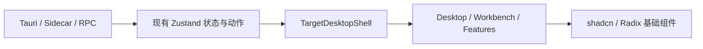

# GitPilot Desktop shadcn UI 整体替换技术设计 v1

> 状态：目标 Graphite Workbench 已成为唯一生产渲染树；业务样式已按组件边界收敛到 CSS Module。静态检查、MSI/NSIS 构建、安装包 sidecar 启动烟测、原生文件夹选择、窗口控制、托盘恢复和三种窗口尺寸的原生键鼠验收已通过；UI Gallery 已补充 60 任务、长项目/任务名、长正文/代码/表格、60 项附件和 13 步连续工具批次原生截图证据。整体替换验收完成。
>
> 目标：整体替换 GitPilot Desktop 的 React UI 与视觉系统，同时保持 Tauri、sidecar、RPC、Zustand 和安全边界不变。

## 1. 结论

GitPilot Desktop 可以整体采用 shadcn/ui，但“整体替换”指重建 React 渲染层和组件体系，不是使用 Create 命令覆盖现有 Vite/Tauri 项目。

本方案确定以下基线：

| 项目 | 选型 |
|---|---|
| 组件底座 | Radix UI |
| shadcn 风格 | Mira，面向紧凑界面 |
| 基础色 | Neutral，碳黑/石墨灰 |
| 图标 | Lucide，复用现有依赖 |
| CSS | Tailwind CSS v4 + CSS Variables |
| 字体 | Bahnschrift + Cascadia Code，Windows 离线可用 |
| 产品风格 | Graphite Operator Console |
| 迁移方式 | 单一目标渲染树 + 分区 CSS Module |
| 行为边界 | 保留现有 store、RPC、Tauri adapter 和 sidecar |

## 2. 当前基线与问题

当前 Desktop 已实现：

- Tauri 无边框窗口、原生拖动、最小化、最大化、关闭隐藏和托盘常驻。
- 项目/项目任务/独立任务侧栏和会话切换。
- 流式对话、Markdown、附件、会话时间轴和输入器。
- 工具执行批次、右侧检查器、输出面板和应用内 PowerShell 终端。
- 模型、思考级别、slash 命令、全局命令面板和扩展交互模态。
- Zustand 状态、RPC bridge、平台连接探测和 8 组核心 Vitest 测试。

主要问题是 UI 架构没有形成稳定分层：

1. 基础按钮、菜单、弹层、输入和滚动行为在多个业务组件中重复实现。
2. `src/index.css` 同时承担 Tailwind 入口、主题令牌、工作台布局和全部业务选择器。
3. 视觉调整容易影响窗口拖动、滚动条、输入器透明命中区和弹层层级。
4. 旧组件没有统一的焦点、键盘和可访问性实现。
5. 局部继续修补会让 shadcn token 与旧类名长期混杂，最终无法清理。

## 3. 替换边界

### 3.1 整体替换的内容

- `App` 的视觉组合树。
- 自定义标题栏和账户入口的外观。
- 左侧项目任务导航。
- 对话消息、执行摘要、会话时间轴和输入器。
- 模型选择、思考级别、slash 命令和全局命令面板。
- 右侧执行检查器、底部输出/终端壳和状态栏。
- 扩展 Dialog、登录、断线、错误和右键菜单。
- 全局 token、动效、间距、字体、边界和层级系统。

### 3.2 必须保持的内容

- `useSessionStore`、`useWorkbenchStore` 的业务 action 和事件归并语义。
- sidecar RPC 命令、事件类型和 JSONL 链路。
- 历史会话文件、项目目录和模型/思考级别提交值。
- Tauri 窗口、托盘、终端、目录选择和剪贴板降级适配器。
- 平台后端状态与本地 sidecar 状态分离的语义。
- Agent 文件、Shell、Git 和网络能力仍只能经过 sidecar 安全边界。



生产环境只挂载一个目标 UI，避免重复建立 RPC 连接、事件订阅和快捷键监听。

## 4. 视觉方向：Graphite Operator Console

### 4.1 设计原则

- **桌面优先**：界面像编码工具，不像浏览器中的 SaaS 管理后台。
- **紧凑但可读**：标题栏、侧栏、状态栏使用 Mira 密度；长正文和代码区域保持阅读空间。
- **状态真实**：绿色、黄色、红色仅表达真实连接、等待、完成和错误状态。
- **结构克制**：主要依靠亮度层级、1px 分隔线和局部内阴影，不使用泛滥的卡片、渐变和大圆角。
- **执行可感知**：对话工具摘要和右栏步骤详情共享“执行轨道”视觉语义。

### 4.2 颜色层级

| Token | 用途 | 建议值 |
|---|---|---|
| `--background` | 应用底色 | `#111214` |
| `--card` | 面板表面 | `#17181b` |
| `--popover` | 菜单与弹层 | `#1d1f23` |
| `--muted` | 次级表面 | `#23252a` |
| `--border` | 默认分隔 | `#2d3036` |
| `--foreground` | 主文本 | `#f0f1f2` |
| `--muted-foreground` | 次级文本 | `#92979f` |
| `--primary` | 主动作 | `#d8dbe0` |
| `--destructive` | 错误/危险 | `#ef6461` |
| `--gp-status-success` | 成功/在线 | `#4cc38a` |
| `--gp-status-warning` | 等待/检查 | `#d6a84f` |

最终色值在实施时通过原生 Tauri 截图进行微调，不以浏览器预览作为验收结果。

### 4.3 字体与尺寸

- 正文：Bahnschrift，回退 Segoe UI Variable、Microsoft YaHei UI。
- 代码、路径、状态和快捷键：Cascadia Code，回退 JetBrains Mono、Consolas。
- 标题栏 38px，状态栏 28px，常规行 30–36px。
- 常规圆角 6px，浮层 8px，输入器 14px；避免全界面胶囊化。
- 动效 120–220ms；减少动效模式下关闭位移和缩放。

## 5. 目标组件架构

```text
gitpilot-desktop/src/
├─ components/
│  ├─ ui/                 shadcn 生成组件
│  ├─ desktop/            窗口、标题栏、右键菜单、状态栏
│  ├─ workbench/          三栏工作台、面板和调整器
│  └─ features/           对话、输入、模型、命令、扩展交互
├─ desktop/               Tauri 能力适配器，保持与 UI 解耦
├─ store/                 现有会话和工作台状态
├─ styles/
│  ├─ tokens.css          唯一语义令牌
│  ├─ base.css            全局原语基础
│  └─ motion.css          reduced-motion 基线
├─ App.tsx                生命周期和 UI 版本选择
└─ index.css              Tailwind 与样式入口
```

### 5.1 shadcn 配置约束

- `rsc: false`
- `tsx: true`
- Tailwind v4 `config` 为空
- CSS 入口为 `src/index.css`
- 不修改当前 `@/* -> ./*` 根级映射
- aliases 使用 `@/src/components`、`@/src/components/ui`、`@/src/lib/utils`
- CLI 初始化结果必须人工合并，禁止覆盖现有 `index.css`

### 5.2 组件映射

| 当前区域 | 新基础组件 | 保持的行为 |
|---|---|---|
| DesktopTitleBar | Button、Tooltip、DropdownMenu | Tauri 拖动与窗口控制 |
| SessionSidebar | ScrollArea、ContextMenu、Collapsible | 项目树和会话 action |
| ChatView | 自定义 ConversationPane | 首帧到底部和 stick-to-bottom |
| InputBox | Textarea、Button、Popover、Badge | prompt、abort、附件和拖放 |
| ModelPicker | Command、Popover | 模型值与思考级别值 |
| GlobalCommandPalette | Command、Dialog | 快捷键优先级 |
| ExtensionUIModal | Dialog、Input、Textarea、Command | extension response 协议 |
| ExecutionInspector | Tabs、ScrollArea、Separator | 真实工具生命周期和步骤选择 |
| WorkbenchLayout | Resizable、Sheet、Tabs | 布局持久化和底栏切换 |
| DesktopContextMenu | ContextMenu、DropdownMenu | 指针定位和业务动作 |

## 6. 工作台布局

### 6.1 标准窗口

```text
┌──────────────────────────── 38px 标题栏 ────────────────────────────┐
├──────────────┬──────────────────────────────┬───────────────────────┤
│ 项目/任务     │ 对话与输入                    │ 执行轨道/步骤详情       │
│ 默认 272px    │ minmax(0, 1fr)              │ 默认 344px             │
├──────────────┴──────────────────────────────┴───────────────────────┤
│ 终端 / 输出底栏，默认关闭，打开后 220px                              │
├──────────────────────────── 28px 状态栏 ────────────────────────────┤
└─────────────────────────────────────────────────────────────────────┘
```

- 左栏可调 220–420px。
- 右栏可调 280–520px。
- 对话正文最大阅读宽度 920px。
- 输入器位于中心区底部，外层透明区域不得阻止滚动条点击。

### 6.2 最小窗口 800x500

- 右栏默认折叠，通过 Sheet 打开。
- 左栏允许折叠为窄导航或 Sheet。
- 对话与输入器始终保留。
- 底栏打开时限制最大高度，不能挤掉输入器和状态栏。

## 7. 交互契约

### 7.1 标题栏

- 非按钮区域按下左键调用 `startDraggingWindow()`。
- 窗口按钮和账户菜单阻止 `mousedown` 传播。
- 关闭继续执行主进程定义的隐藏/托盘语义。

### 7.2 对话滚动

- 打开新会话或历史会话时在首次布局阶段直接定位到底部。
- 用户接近底部时流式内容自动跟随。
- 用户上滚阅读时不得强制拉回。
- shadcn ScrollArea 不替换对话主滚动容器。

### 7.3 弹层与快捷键

- 使用统一 overlay root 和 z-index 表。
- Esc 顺序：关闭最上层 UI → 处理扩展交互 → 中止 Agent。
- Dialog、Sheet、Menu 关闭后焦点返回触发器。
- 右键菜单始终阻止浏览器默认菜单，按窗口边界修正位置。

### 7.4 状态栏

状态栏必须分开呈现：

- 平台后端连接状态。
- 本地 sidecar/工作台加载状态。
- Agent 当前执行状态。
- 终端入口和当前项目信息。

## 8. 迁移方案

### 阶段 0：冻结基线

- 运行测试、构建、Rust 和编码检查。
- 保存三种窗口尺寸的 Legacy 截图。
- 补齐标题栏、命中区、右键菜单和扩展弹层测试。

### 阶段 1：设计系统

- 在临时 Vite 项目生成 Mira/Radix preset。
- 接入 `components.json`、依赖、工具函数、token 和基础组件。
- 旧 UI 保持默认，确保设计系统接入不改变业务行为。

### 阶段 2：目标工作台壳

- 新建 `TargetDesktopShell`。
- 抽取只执行一次的连接和快捷键生命周期。
- 实现标题栏、三栏布局、底栏、状态栏和窄窗口降级。
- 业务组件按 `desktop`、`workbench`、`features` 目录拆分，并通过局部 CSS Module 维护样式责任。

### 阶段 3：导航与对话

- 替换侧栏、消息、时间轴、输入器、模型和命令面板。
- 每替换一块，保持对应 store/action 和测试不变。

### 阶段 4：执行与弹层

- 替换执行摘要、检查器、输出、终端壳、扩展模态、登录和右键菜单。

### 阶段 5：默认切换

- 完成自动化和原生窗口矩阵验收后，将目标工作台设为唯一默认入口。
- 当前迁移已删除 Legacy 渲染树，不再通过环境变量并行挂载第二套 UI；回滚边界只保留在 Git 提交和安装包版本层。

### 阶段 6：清理

- 删除旧组件、legacy CSS、旧 token alias 和无用依赖。
- 再次执行完整构建、安装包和原生交互验收。

## 9. 风险与回滚

| 风险 | 级别 | 控制措施 |
|---|---|---|
| CLI 覆盖 `index.css` 或路径别名 | 高 | 临时工程生成，人工迁移和 diff 审核 |
| 连接和事件订阅重复 | 高 | 新旧 UI 只挂载一套，生命周期提升到选择器外层 |
| 标题栏和滚动条命中回归 | 高 | 专门测试 + 原生窗口冒烟 |
| 弹层层级/焦点异常 | 高 | 统一 overlay root、z-index 和键盘矩阵 |
| 旧新 token 长期混杂 | 中 | legacy alias 设置明确删除门槛 |
| bundle 增长 | 中 | 按需安装 Radix 依赖并记录差异 |
| 紧凑布局降低正文可读性 | 中 | 对话正文使用独立阅读密度 |

当前版本没有 `TAURI_DESKTOP_UI_V2` 运行时开关，也不再保留 Legacy UI；如需回退，使用版本控制或上一版安装包恢复，不能回滚 store、RPC、会话文件或 Tauri 主进程契约。

### 安装态 sidecar 资源解析

Tauri externalBin 在 MSI/NSIS 中会将 sidecar 规范化为 `gitpilot-rpc.exe`，而源码目录仍使用带 target 后缀的产物。Rust 启动层按两种文件名顺序查找，并向 sidecar 注入 `PI_PACKAGE_DIR=<安装目录>/resources`，使 Bun 运行时从安装包实际的 `resources/theme` 和 `resources/export-html` 读取资产。该边界已通过 MSI 管理员提取与提取目录启动烟测验证。

## 10. 验收标准

### 10.1 自动化

- `cd gitpilot-desktop && npm.cmd run test`
- `cd gitpilot-desktop && npm.cmd run build`
- `cd gitpilot-desktop/src-tauri && cargo check`
- `python scripts/check_encoding.py`
- `git diff --check`
- Windows `tauri build` 并检查 MSI/NSIS 资源。

### 10.2 原生窗口矩阵

必须在 1100x720、1440x900、800x500 三种尺寸验证：

- 标题栏拖动、最小化、最大化、关闭和托盘恢复。
- 项目展开、任务切换、右键菜单和路径复制。
- 历史会话初始定位、流式跟随和用户上滚保持。
- 输入、停止、附件拖放、模型和思考级别选择。
- 命令面板、扩展 Dialog、遮罩、Esc 和焦点返回。
- 执行摘要、步骤检查器、输出和终端。
- 平台连接与本地 sidecar 状态分别显示。

只有构建通过但没有原生 WebView 验收，不能视为整体替换完成。

### 10.3 本轮长场景证据

开发态 `?ui-gallery` 由 `TargetUIGallery` 注入稳定夹具，不连接真实 sidecar，避免验收数据受用户本机历史会话影响。当前夹具包括：

- 60 个项目任务、超长项目名和超长任务名，用于检查固定列、省略号、标题提示与滚动边界。
- 长 Markdown 正文、代码块和 GFM 表格，用于检查阅读区换行、代码横向滚动和窄窗口降级。
- 60 项混合图片/文本/文档附件，用于检查附件 chip 的最大宽度、内部滚动和长文件名处理。
- 13 步连续 `read/edit/command/verify` 工具批次，用于检查摘要折叠和原始步骤详情保留。
- 长模型名与思考级别控件，用于检查模型触发器的省略与操作区固定宽度。

本轮原生 `PrintWindow` 截图保存在 `.run-logs/ui-gallery-800.png`、`.run-logs/ui-gallery-1100-final.png`、`.run-logs/ui-gallery-1440.png` 和 `.run-logs/ui-gallery-1440-scroll.png`；这些截图只作为本地验收证据，不作为生产资源。

### 10.4 视觉强化阶段

针对“组件架构已替换但视觉变化不明显”的反馈，本轮在不改变 RPC、store 和交互契约的前提下完成了视觉强化：

- 主题令牌统一为午夜石墨底色、青绿色主操作色和琥珀色执行提示色，避免继续依赖中性灰造成层级不明显。
- 标题栏增加品牌状态点、双端渐变边界和按钮悬浮反馈，保留无边框窗口拖动与原生窗口控制。
- 项目/任务侧栏增加分区层级、项目行悬浮边界、当前任务轨道和右侧状态边线，长名称仍由固定列与省略号约束。
- 侧栏使用 `ScrollArea fitContent` 约束 Radix 内容包装器，并让任务按钮采用 `border-box`、`min-width: 0`、`max-width: 100%`，保证拖动缩窄侧栏时任务内容随列宽收敛。
- 输入器改为带顶部操作轨道的浮动工作台，附件 chip、模型选择和发送按钮共享同一焦点层级，透明外层命中区规则不变。
- 执行面板增加阶段轨道、状态色、步骤卡片和详情边线；对话中心增加低对比网格与径向光晕，提升工作区辨识度但不影响正文阅读。

视觉强化只修改 `tokens.css` 与对应 CSS Module，不新增全局业务选择器；生产包已重新构建，并通过前端测试与样式边界检查。

### 10.5 三套界面主题

工作台提供三套可持久化主题，切换入口位于标题栏右侧头像菜单，菜单只显示三个主题色圆形色块，并保留悬浮提示与无障碍名称：

- `当前主题`：午夜石墨底色、青绿色操作色和琥珀色执行提示，保持现有 Graphite Operator Console 视觉。
- `黑底白字`：纯黑背景、白色正文、灰色辅助信息，适合低干扰长时间编码。
- `白底黑字`：白色背景、黑色正文和深青色操作色，保证浅色环境下正文、代码、终端与弹层仍有足够对比度。

主题状态由 `src/store/theme.ts` 管理，使用 `localStorage` 持久化，并通过 `document.documentElement[data-theme]` 驱动 `tokens.css`。业务组件只消费语义令牌；终端在主题变化时同步 xterm 配色，避免出现浅色工作台内嵌纯黑终端的不一致状态。

本地 sidecar 与平台后端的连接状态不再分散显示在标题栏和底部状态栏，而是合并为头像右下角的固定状态圆点：两者均可达时显示绿色，否则显示红色；颜色使用固定状态色，不随主题切换。

### 10.6 任务切换期间的后台执行与恢复

任务列表通过 RPC `list_sessions` 的 `isStreaming` 字段识别仍在执行的会话，并在任务图标位置显示旋转 loading。切换任务时，若当前 `AgentSession` 仍处于流式执行状态，`AgentSessionRuntime` 将其放入进程内 suspended runtime 映射，不调用 `dispose()`/`abort()`；切回时复用同一实例并重新绑定 RPC 事件订阅。这样后台任务可继续写入原 session 文件，切回后通过 `get_state` 与 `get_messages` 恢复正文和执行状态。应用退出时统一释放当前及 suspended runtime，避免资源泄漏。

## 11. 实施入口

- OpenSpec 提案：`openspec/changes/complete-gitpilot-desktop-ui-replacement/proposal.md`
- OpenSpec 设计：`openspec/changes/complete-gitpilot-desktop-ui-replacement/design.md`
- 能力规格：`openspec/changes/complete-gitpilot-desktop-ui-replacement/specs/`
- 实施任务：`openspec/changes/complete-gitpilot-desktop-ui-replacement/tasks.md`

实施结果：`gitpilot-desktop/src` 已接入 shadcn/Radix 基础组件，并建立 `components/desktop`、`components/workbench`、`components/features` 目标目录。`TargetDesktopShell` 现在是唯一生产渲染入口，标题栏、三栏面板、项目/任务导航、对话/输入器、执行检查器、输出/终端、登录与弹层均已按边界拆分；业务样式已迁移到 CSS Module，`index.css` 仅保留入口和文档级基础，旧业务选择器与 token alias 已清理。store、RPC、Tauri 与 sidecar 安全边界未改变。静态测试、构建、边界检查、Cargo 检查、MSI/NSIS 构建、MSI 资源提取、提取目录 sidecar 启动烟测、原生文件夹选择、窗口控制、托盘恢复以及 1103×723、1428×894、788×494 三档原生截图/交互均有记录；50+ 任务、大附件、长正文、连续工具批次和长模型名已由 UI Gallery 固定夹具补齐，整体替换已完成。

后续维护以现有 Graphite Workbench、shadcn/Radix 基础组件和 CSS Module 边界为准；新增 UI 必须通过样式边界检查和原生窗口回归，禁止重新引入 Legacy 渲染树、旧 token alias 或全局业务选择器。
