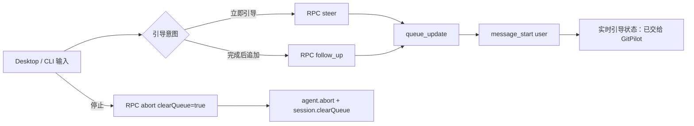

# GitPilot 提问执行引导 P0 技术设计 v1

> 状态：P0 已落地。本文记录 CLI 与 Desktop 的统一执行引导语义、RPC 边界和实时展示约束。

## 1. 目标与边界

P0 将运行中的输入从“只能停止或隐式 steer”收敛为两个显式意图：

- **立即引导**：通过 `steer` 在当前工具回合结束后的下一次 Agent 决策前生效。
- **完成后追加**：通过 `follow_up` 在当前任务没有更多工具和引导后执行。

停止操作通过 `abort(clearQueue: true)` 中止当前执行并清除尚未消费的两类队列。停止不会回滚已经发生的文件、Shell 或网络副作用。

P0 不包含服务端稳定队列 ID、服务端单条取消/排序、停止并改做、引导类型持久化、暂停工具和自动回滚。Desktop 只保留尚未交给 GitPilot 的引导记录，支持编辑、再次引导或删除；一旦正常进入 GitPilot，队列项移除并回到主对话展示。

## 2. 运行链路



CLI 是执行队列的事实来源；Desktop 的 `guidanceQueue` 只保存 UI 镜像，必须以 sidecar 的 `queue_update` 和 `message_start` 为准。

## 3. RPC 契约

`abort` 在兼容原有客户端的前提下增加可选字段：

```json
{"type":"abort","clearQueue":true}
```

启用 `clearQueue` 时，成功响应可以携带：

```json
{
  "command": "abort",
  "success": true,
  "data": {
    "clearedSteering": 1,
    "clearedFollowUp": 1
  }
}
```

旧客户端不传 `clearQueue` 时保持原有停止语义。

## 4. Desktop 状态与展示

Desktop 输入器在 `isStreaming` 时不再展示突兀的模式切换栏：有正文或附件时主按钮显示“发送”，空输入时显示“停止”。“发送”只建立本地待处理项；点击列表“引导”才调用 `steer`，当前任务自然结束时未处理项自动启动下一轮并按后续内容发送。

本地队列项仅展示用户原话和附件元数据，不展示带 `<file>` 注入内容的 wire 文本。输入框上方最多展示 5 条尚未交给 GitPilot 的引导记录，支持“引导”（再次 steer）、编辑和删除；正常开始执行后移除队列项并在主对话中展示一次。状态顺序为：

```text
submitting -> queued -> applying -> applied
                    \-> cancelled
                    \-> failed
```

`queue_update` 只负责判断 sidecar 队列；本地待处理项在 `message_start` 或任务结束自动派发成功后移除，主对话只保留一份已发送消息。发送失败时保留列表项并显示错误。

扩展 Slash 命令不能在执行期间排队，Desktop 在发送前阻止并提示停止任务后执行；Prompt/Skill 命令继续交给 sidecar 展开。

引导消息使用 `UIMessage.meta.guidanceMode/guidanceStatus` 显示徽标，但不计入会话时间轴的原始用户提问节点。

## 5. CLI 展示

CLI 保留已有快捷键：

- `Enter`：立即引导
- `Alt+Enter`：完成后追加
- `Esc`：停止并恢复未执行队列到编辑器
- `Alt+Up`：取回全部排队消息

队列标签使用“立即引导”和“完成后追加”，发送成功/失败通过临时状态行反馈，不伪造新的正文进度。

## 6. 验证要求

- Desktop TypeScript 检查、InputBox/session 定向测试和生产构建通过。
- CLI TypeScript 构建、队列和交互模式定向测试通过。
- 必须验证：两种队列顺序、`queue_update` 到 `message_start` 的状态推进、停止清队列、附件脱敏、扩展命令阻止和停止不回滚文案。
