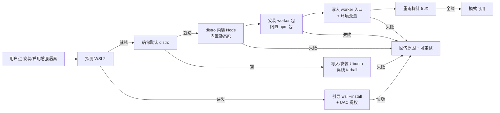

# Gondolin 增强隔离 Worker 与安装器技术设计（v1）

> 姊妹文档：`desktop-security-sandbox-technical-design-v1.md`（已有，描述双模式安全边界与阻断原则）。
> 本设计解决其遗留缺口：**探针与 UI 引导已就位，但 Gondolin worker 未真正接入，且安装依赖用户手动 dev 级配置，普通用户装不起来。**

## 1. 背景与目标

### 1.1 现状（2026-08-21 核对）
- `gitpilot-cli/src/core/security/sandbox-executor.ts` 的 `GondolinExecutor` 已完成**能力探测**与**失败阻断**：
  - 探针五项：`wslInstalled` / `virtualizationReady` / `distributionInstalled` / `nodeInstalled` / `workerInstalled`。
  - `workerInstalled` 当前仅检查 `process.env.GITPILOT_GONDOLIN_WORKER`，注释写明「正式打包目录由 Desktop 安装器注入；环境变量只用于开发和测试探测」。
  - `executeTool()` 直接抛错：`"Gondolin worker 尚未接入当前构建"`。
- rpc 模式里 `sandboxExecutor.executeTool` **从未被调用**（`rpc-mode.ts` 无调用点），所以即便切到 `gondolin` 模式，工具仍跑在宿主进程，没有真正进入 VM。
- Desktop `SecuritySettings.tsx` 只展示静态「缺失」文案 + 「重新检测」按钮，没有安装流程。
- Desktop 是 Tauri 应用，已有签名更新器 `desktop-updater.ts`，但**没有 WSL2 / Node / worker 的供给逻辑**。

### 1.2 问题
用户当前看到的「Node 缺失 / worker 缺失」**无法通过任何 UI 操作消除**：
- Node 缺失：理论上可在 WSL2 里手动装，但用户不该做这一步。
- worker 缺失：**当前构建根本没有可装的 worker 包**，环境变量也无从注入。

### 1.3 目标（用户决策）
> 「要把东西都打进安装器，否则用户装不起来。」

交付后，用户只需在 UI 点一次「安装/启用增强隔离」，Desktop 自动完成 WSL2 → 发行版 → Node → worker 的探测/安装/校验，使五项探针全绿，且工具真正在 Gondolin micro-VM 内执行。**全程无手动 dev 级配置、不静默降级、失败有可读原因且可重试。**

## 2. 设计原则
1. **开箱即用**：不要求用户手动装 Node、配环境变量或跑脚本。
2. **不静默降级**：沿用既有原则——WSL2/Node/worker 任一未就绪则阻断执行，不回退到无限制本机模式。
3. **可审计的安装过程**：UI 展示分阶段状态与失败原因，而非只显示「缺失」。
4. **离线友好**：将 Node 静态构建与 worker 包打进 Desktop 安装包 resources，安装时复制到 WSL2，避免首次使用强依赖外网。
5. **隔离边界清晰**：VM 提供网络 `deny-by-default` 与非 `/workspace` 写隔离；宿主工作区仅通过 `/workspace` 挂载穿透写回（与上游 `gitpilot-cli/docs/security.md` 「run host pi while routing built-in tool execution into a Gondolin micro-VM」一致）。

## 3. 架构总览

```mermaid
flowchart TD
  A[AgentSession 工具调用] --> B{sandbox executor}
  B -- windows-native --> C[宿主进程内置工具<br/>策略+审批]
  B -- gondolin --> D[GondolinExecutor.executeTool]
  D --> E[host↔worker RPC<br/>stdio JSON-lines]
  E --> F[(Gondolin worker 进程<br/>运行于 WSL2 distro 内)]
  F --> G[@earendil-works/gondolin micro-VM]
  G --> H[read/write/edit/bash/<br/>find/grep/ls 在 guest 执行]
  H --> I[仅 /workspace 穿透写回宿主<br/>其余变更隔离在 VM]
  G -. 网络 deny-by-default .- J[网络访问被沙箱强制拦截]
```

配套安装链路（本设计核心）：



## 4. 关键决策（含待确认项）

### D1. Worker 运行形态（推荐：独立进程在 WSL2 内，非 sidecar 进程内）
- **推荐**：worker 是跑在 WSL2 默认 distro 内的独立 Node 进程；宿主 sidecar 通过 stdio JSON-lines（与现有 RPC 同源）下发 `ToolExecutionRequest`、收回 `ToolExecutionResult`。
- **理由**：
  - 隔离边界最干净：worker 崩溃不影响宿主 sidecar，VM 逃逸也先落在 Linux guest 而非 Windows 宿主。
  - 与探针语义对齐：探针本就认定「distro 内 Node」是 worker 的运行环境。
  - 启动方式：`wsl.exe -d <distro> -- <worker-entry> --workspace <hostPath>`，宿主工作区经 9P/DrvFS 挂载为 guest `/workspace`（具体挂载方式见 D2）。
- **备选**：在 sidecar 进程内直接 `VM.create`（如示例扩展）。隔离弱、且需侧端有 Linux 运行时——与现有「WSL2 探针」脱节，不推荐。

### D2. Gondolin 与 WSL2 的角色分工
- **WSL2**：提供 Linux 运行时宿主机（gondolin micro-VM 需要 Linux 用户态）。
- **Gondolin micro-VM**：提供工具执行的网络 `deny-by-default` 与文件写隔离；宿主工作区以 `/workspace` 挂载，写穿透回宿主。
- **两级挂载链路（v1 澄清）**：宿主 Windows 工作区 `C:\...` 先经 WSL2 自动挂载（9P）在 distro 内可见为 `/mnt/c/...`；worker 再以该路径为 `RealFSProvider` 挂到 gondolin guest 的 `/workspace`。sidecar 启动 worker 时负责 `C:\... → /mnt/c/...` 的路径翻译。

### D3. 平台范围（待用户确认，推荐：v1 Windows/WSL2 独占）
- 探针当前实现 `process.platform !== "win32"` 直接返回全 false，故 **v1 仅 Windows/WSL2**。
- macOS/Linux 后续：上游示例依赖 QEMU（`brew install qemu`），与 WSL2 路径不同，单列 v2。

### D4. 离线分发（推荐：内置包而非联网安装）
- 安装包 resources 内置：Node 静态 tarball（按 arch）、worker npm 包（含 `@earendil-works/gondolin` 及 tool factories 的离线 tarball）。
- 安装器复制到 distro 固定路径（如 `/opt/gitpilot-gondolin/`），用 `npm ci --offline` 或解压即用，避免首次使用强联网。

## 5. Worker 运行时设计
- **落地位置**：新建 `gitpilot-cli/src/core/security/gondolin-worker/`（或 `packages/gondolin-worker`），从 `examples/extensions/gondolin/index.ts` 提炼为**独立、可单测**的 worker 入口。
- **复用（v1 勘误）**：tool factories 复用 **gitpilot-cli 自家实现 `src/core/tools/`**（`createReadTool` 等均支持 `options.operations` 注入，可把 IO 后端替换为 VM，见 `read.ts` 的 `ReadToolOptions`）；VM 层依赖 `@earendil-works/gondolin` 的 `VM`/`RealFSProvider`。示例扩展 import 的 `@earendil-works/pi-coding-agent` 是上游 pi 的包名，本仓库不直接依赖，worker 不引入。
- **host↔worker 协议**：复用既有 `ToolExecutionRequest` / `ToolExecutionResult`（见 `security-policy.ts`）以 stdio JSON-lines 通信；worker 自包含超时（沿用 120s 默认 / 600s 上限）与 abort。握手帧携带协议版本与 worker 版本，主版本不一致即拒绝并回传「需修复」。
- **进程生命周期（v1 补充）**：
  - 启动：`GondolinExecutor.initialize` 成功后拉起 worker，并完成一次握手健康检查；首次工具调用前 worker 必须就绪。
  - 崩溃：worker 退出/失联 → 本会话工具调用立即阻断并回传结构化错误（含退出原因），由用户决定重试；不静默自动重启，避免掩盖问题。
  - 停止：沿用 `sandboxExecutor.shutdown()`，先发终止帧等待退出，超时强杀。
- **隔离语义**：
  - 只有解析进 `/workspace` 的读写穿透回宿主；其他 guest 路径变更隔离在 VM。
  - 网络 `deny-by-default`，由 VM 强制；后续如确需放行，走明确的允许名单而非放开整张网。

## 6. 探针升级（sandbox-executor.ts）
- `workerInstalled`：从「读环境变量」改为「检查 WSL2 distro 内固定路径的 worker 入口是否到位」（安装器写入后即为 true）。环境变量保留为 dev override。
- **修复现存缺陷 1（v1 补充）**：`virtualizationReady` 目前是硬编码 `true`（`sandbox-executor.ts` 的 `probe()` 在 `wsl --status` 成功后直接返回 `virtualizationReady: true`），并未真实检测虚拟化就绪；需真实实现或从探针移除，避免 UI 展示假绿。
- **修复现存缺陷 2（v1 补充）**：`wsl.exe` 系列命令输出为 UTF-16LE，Node `execFile` 默认按 utf8 解码会得到 `\x00` 交错的乱码；现有 `wsl -l -q` 的 `stdout.split(/\r?\n/).some(line => line.trim().length > 0)` 判定不可靠（`\x00` 不被 `trim` 移除，空列表也可能误判为已装发行版）。需按 utf16le 解码或清洗后再解析。
- `SandboxStatus` 新增安装态字段（供 UI 消费）：`installState: 'idle'|'installing'|'ready'|'error'`、`installProgress?`、`installError?`。
- `executeTool()`：从 stub 改为通过 host↔worker RPC 真正派发工具执行；失败/未初始化仍按既有原则阻断。

## 7. 安装器设计（Desktop / Tauri，核心交付）
**触发时机**：用户首次切到增强隔离，或在 SecuritySettings 点「安装 / 修复」。

**Windows/WSL2 步骤**：
1. 探测 `wsl --status`；缺失 → 引导/调用 `wsl --install`（需管理员；通过 Tauri 提权或提示用户授权 UAC）。
2. 确保默认 distro：`wsl -l -q` 非空；空 → 导入/安装 Ubuntu（离线场景用 `--import` + 内置 tarball）。
3. 在 distro 内装 Node：优先用安装包内置 Node 静态包解压到固定路径（离线）；否则回退 `apt install nodejs`。
4. 安装 worker：复制安装包 resources 内的 worker 包到 distro 固定目录，离线 `npm ci` 安装。
5. 写入 worker 入口路径，并为 worker 进程注入 `GITPILOT_GONDOLIN_WORKER`（仅 worker 进程内有效）。
6. 重跑探针，确认五项全绿。

**失败处理**：每步可重试，错误原因原样回传 UI；不后台自动安装、不降级（沿用现有阻断原则）。

**完整性校验（v1 补充）**：内置的 Node tarball 与 worker npm 包在复制安装前校验哈希/签名（与 `desktop-updater.ts` 的签名更新姿态一致），防止安装包资源被篡改后注入 WSL2。

**版本协同（v1 补充）**：worker 版本与 sidecar 版本绑定；Desktop 更新后探针检测到 distro 内 worker 版本不匹配时提示「修复」重新供给，握手帧协议版本不匹配即拒绝启动。

## 8. UI 改造（SecuritySettings.tsx）
- 把静态「缺失」文案替换为分阶段状态：`未安装 / 检测中 / 安装中(进度) / 就绪 / 失败(原因)`。
- 新增「安装增强隔离」/「修复」按钮（替换或并列「重新检测」）。
- 安装中禁用切换、展示进度；失败展示原因 + 重试。
- 风格与既有 `desktop-updater.ts` 更新状态机一致。

## 9. 风险与取舍
- `wsl --install` 需管理员权限与可能的重启；需明确提示用户。
- WSL2 体积较大、首次下载耗时；离线 tarball 增加安装包体积。
- Gondolin micro-VM 在 WSL2 内的运行时不成熟/依赖需实测（是否仍需 QEMU 等）。
- 网络 `deny-by-default` 可能影响正常任务（如 `npm install` 需要网络），需定义明确放行策略与用户可见提示。
- 宿主↔guest 工作区挂载路径在不同 WSL 版本/发行版下的差异需覆盖测试。
- 9P（`/mnt/c/...`）文件访问在大仓库下性能明显低于原生，工具吞吐可能受影响；如成瓶颈，v2 考虑同步式方案或 WSL2 内 clone 工作区。

## 10. 验收标准
- 全新 Windows 机器（仅装 Desktop），仅通过 UI 点按即可点亮增强隔离，无需任何手动命令行。
- 五项探针全绿；工具在 micro-VM 内执行；`/workspace` 写回宿主；越界写入被隔离；网络默认被拦。
- 任一安装步骤失败有可读原因且可重试，绝不静默降级到无限制本机执行。
- 既有 Windows 原生模式行为不受回归影响。

## 11. 待用户拍板
- **D3 平台范围**：确认 v1 Windows/WSL2 独占（推荐），还是同版本覆盖 macOS。
- **D2 网络策略**：默认全拦 vs 默认放行白名单（影响正常任务体验），需要产品层定调。
