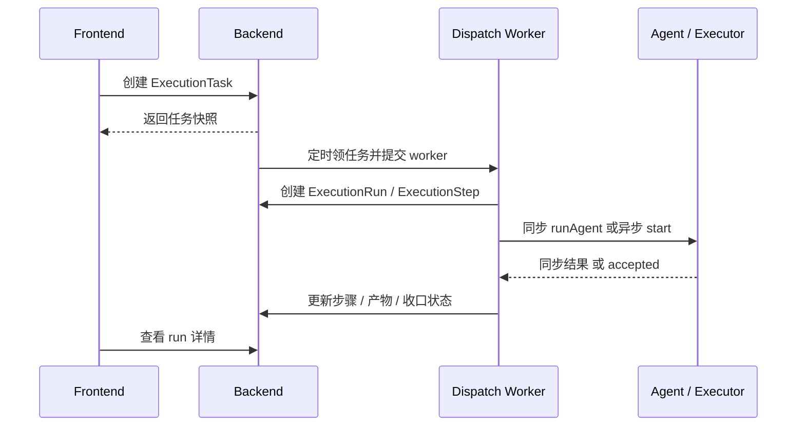
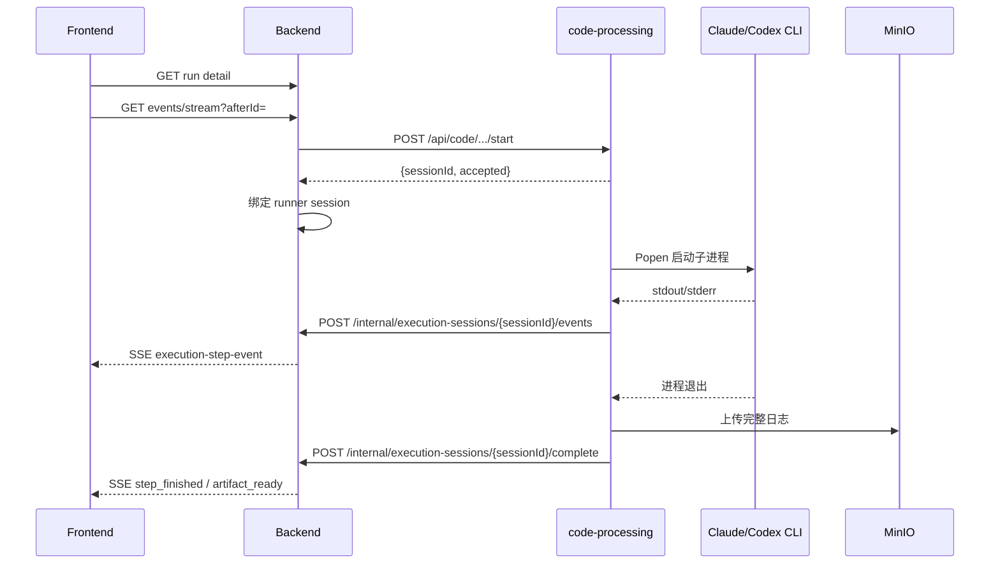

# 执行中心全流程与流式执行一期技术设计

## 1. 文档目标

本文档用于沉淀当前执行中心的完整技术设计，覆盖以下内容：

- 执行中心当前承担的业务职责与场景边界
- 执行任务从创建、编排、调度、执行、产物沉淀到回写的完整链路
- 本次“全执行中心统一展示协议 + CLI 桥接流式执行一期”改造后的数据模型、接口协议与前端展示方式
- 当前代码中的核心实现位置、兼容策略、已知限制与后续演进方向

本文档描述的是“当前仓库已经实现到的状态 + 少量明确的后续建议”，会尽量区分“已落地”与“建议二期演进”。

---

## 2. 适用范围

当前执行中心覆盖以下场景：

- `REQUIREMENT_BREAKDOWN`：需求拆解
- `DEVELOPMENT_IMPLEMENTATION`：开发执行
- `TEST_DESIGN_OR_REVIEW`：测试设计 / 评审
- `AD_HOC_AGENT_RUN`：临时单次执行
- `CODEBASE_COMPLIANCE_SCAN`：仓库规范扫描

其中：

- `DEVELOPMENT_IMPLEMENTATION` 与 `AD_HOC_AGENT_RUN` 会复用内部 Claude / Codex / 测试桥
- `CODEBASE_COMPLIANCE_SCAN` 走专用扫描执行器，不复用通用步骤串行逻辑
- 其他场景仍可走通用步骤执行链路

---

## 3. 设计目标

### 3.1 一期目标

- 保持执行中心对外仍是统一的任务、运行、步骤、产物模型
- 所有场景都通过统一事件协议对外展示运行状态
- 内部 CLI 桥接步骤支持 `stdout/stderr` 实时流
- 执行详情页从“纯快照轮询”升级为“快照 + SSE + 尾日志”
- 历史任务、旧同步任务、无事件任务保持兼容可读

### 3.2 非目标

- 一期不引入独立的 `execution_step_session` 表
- 一期不把所有 Agent 都改成真正的流式 runner
- 一期不做前端虚拟日志列表
- 一期不移除现有 artifact、快照、回写机制

---

## 4. 总体架构

执行中心当前是一个“前端详情页 + backend 编排调度 + code-processing 执行桥 + MinIO 日志产物”的组合系统。

```text
前端 ExecutionTaskDetailView
  -> backend ExecutionTaskService / ExecutionRunController
     -> ExecutionDispatchService
        -> 通用步骤执行
        -> DevelopmentExecutionService
        -> RepositoryScanExecutionService
     -> AgentExecutionService
        -> code-processing 同步接口
        -> code-processing 异步 start 接口
     -> ExecutionEventService
        -> execution_step_event
        -> execution_step 聚合快照
        -> SSE 输出
     -> ExecutionAsyncSessionService
        -> runner session 绑定
        -> 内部事件回调消费
        -> watchdog 超时收口
code-processing
  -> Claude/Codex/Test CLI
  -> backend /internal/execution-sessions/... 回调
  -> MinIO 完整日志上传
```

### 4.1 模块职责

#### frontend

- 创建执行任务、查看执行详情
- 先拉取任务与 run 快照
- 对正在执行的 run 建立 SSE 订阅
- 展示步骤概览、当前命令、心跳状态、尾日志、结构化产物

#### backend

- 创建执行任务与工作流快照
- 轮询待执行任务并提交到异步 worker
- 执行通用步骤或专用执行器
- 汇聚 runner 事件、维护步骤聚合状态、输出 SSE
- 在任务结束时统一收口状态并执行 artifact 回写

#### code-processing

- 提供 Claude / Codex / Test 桥接能力
- 新增异步 `start` 接口
- 用 `subprocess.Popen` 流式读取子进程输出
- 按批回调 backend 事件
- 完成时上传完整日志 artifact

---

## 5. 核心领域模型

执行中心当前以 5 类核心实体组织数据。

### 5.1 `ExecutionTask`

语义：用户在执行中心提交的一次业务级执行请求。

主要职责：

- 绑定场景、项目、工作项、触发来源
- 保存输入快照与 Agent 绑定快照
- 指向当前运行 `currentRun`
- 作为回写、重试、取消的入口

### 5.2 `ExecutionRun`

语义：某个执行任务的一次实际运行实例。

主要职责：

- 保存 run 序号与整体状态
- 保存运行级输入快照、输出摘要、错误摘要
- 表示当前运行到第几步
- 作为前端详情页的主视图对象

### 5.3 `ExecutionStep`

语义：run 内部的单个执行步骤。

主要职责：

- 保存步骤编码、步骤名称、绑定 Agent、输入输出快照
- 保存执行状态、进度、最新摘要
- 在一期内同时承担“步骤会话”的聚合状态

流式化改造后，`execution_step` 额外承担以下 live 聚合字段：

- `runner_session_id`
- `runner_type`
- `current_command`
- `last_event_id`
- `last_event_at`
- `last_heartbeat_at`
- `tail_log_text`
- `tail_log_line_count`
- `has_live_stream`

### 5.4 `ExecutionArtifact`

语义：步骤或运行结束后沉淀的可下载 / 可预览产物。

常见类型包括：

- `STEP_OUTPUT`
- `PLAN_MARKDOWN`
- `REPORT_MARKDOWN`
- `FINAL_SUMMARY`
- `ERROR_SUMMARY`
- `STEP_RAW_LOG`
- `STEP_STDOUT_LOG`
- `STEP_STDERR_LOG`

### 5.5 `ExecutionStepEvent`

语义：运行中的步骤事件流落库记录。

对应迁移文件：

- `backend/src/main/resources/db/migration/V36__execution_streaming_support.sql`
- `backend/src/main/resources/db/migration/V37__execution_step_event_step_nullable.sql`

字段包括：

- `id`
- `run_id`
- `step_id`
- `sequence_no`
- `event_type`
- `stream_kind`
- `payload_json`
- `created_at`

索引包括：

- `(run_id, sequence_no)`
- `(step_id, sequence_no)`
- `execution_step.runner_session_id`
- `execution_step(status, has_live_stream)`

说明：

- 一期使用 `run_id + sequence_no` 作为 SSE 游标
- 一期不单独拆 session 表，`ExecutionStep` 即唯一会话承载对象
- `step_id` 允许为空，用于承载 run 级产物事件，例如最终摘要、取消摘要、基础设施错误摘要、仓库扫描打包产物等

---

## 6. 执行中心全流程

## 6.1 创建任务

入口服务：

- `backend/src/main/java/com/aiclub/platform/service/ExecutionTaskService.java`

创建阶段主要动作：

1. 校验项目、工作项、当前用户可见性
2. 根据场景决定是否要求补充仓库列表、目标分支、Agent 绑定
3. 调用 `ExecutionWorkflowService.buildWorkflow(...)` 生成步骤计划
4. 将步骤与 Agent 绑定快照序列化到 `agentBindingPayload`
5. 生成 `ExecutionTask`

### 6.1.1 开发执行的特殊点

`DEVELOPMENT_IMPLEMENTATION` 支持多仓动态展开，工作流不是固定三步，而是：

- `PLAN`
- 每个仓库一个 `IMPLEMENT`
- 每个仓库一个 `TEST`
- `REPORT`

例如选择两个仓库后，步骤会展开为：

1. 执行规划
2. 开发实现 · 仓库 A
3. 执行测试 · 仓库 A
4. 开发实现 · 仓库 B
5. 执行测试 · 仓库 B
6. 交付报告

### 6.1.2 仓库扫描的特殊点

`CODEBASE_COMPLIANCE_SCAN` 使用专用扫描执行器，任务输入中会带：

- GitLab 绑定
- 分支
- 规则集快照
- 可选扫描计划 Agent

除了最终打包产物外，仓库扫描还会在以下步骤完成后立即沉淀“阶段产物”：

- `normalizeScan`：先生成可预览的“问题索引”摘要
- `buildFixPlan`：立即生成“修复计划 Markdown / 修复分片 Markdown / 修复分片 JSON”
- `summarizeScan`：立即生成“扫描报告 Markdown”

这样执行详情页不需要依赖额外轮询，也能在扫描尚未结束时提前看到中间结果。

---

## 6.2 恢复工作流

入口服务：

- `backend/src/main/java/com/aiclub/platform/service/ExecutionWorkflowService.java`

调度或重试时，不重新做不确定的 Agent 自动匹配，而是优先从 `agentBindingPayload` 恢复：

1. 读取步骤快照
2. 恢复每一步绑定的 Agent
3. 恢复仓库绑定、目标分支、展示名称

这样可保证：

- 重试使用与首次创建一致的 Agent 绑定
- 多仓动态展开后的步骤顺序稳定
- 调度线程不依赖创建时的页面上下文

---

## 6.3 调度任务

入口服务：

- `backend/src/main/java/com/aiclub/platform/service/ExecutionDispatchService.java`

一期改造后的调度策略：

1. `@Scheduled` 定时扫描 `PENDING` 任务
2. 调度线程只负责“领任务并提交到 `executionTaskExecutor`”
3. 真正执行在 worker 线程中完成
4. 使用内存集合 `dispatchingTaskIds` 防止重复提交

这次改造前，调度线程会串行跑完整任务；改造后，调度线程只做派发，不承担长时间执行。

---

## 6.4 worker 执行 run

worker 线程进入 `dispatchTaskNow` 后，会：

1. 再次读取带上下文的 `ExecutionTask`
2. 创建新的 `ExecutionRun`
3. 把任务状态切到 `RUNNING`
4. 按场景分流

场景分流如下：

- `CODEBASE_COMPLIANCE_SCAN` -> `RepositoryScanExecutionService`
- 满足新版开发执行条件 -> `DevelopmentExecutionService`
- 其他 -> 通用步骤串行执行

---

## 6.5 通用步骤执行链路

通用步骤链路用于需求拆解、测试设计、单次执行等场景。

每个步骤主要流程：

1. 创建 `ExecutionStep`
2. 生成步骤输入快照
3. 更新 run 当前步骤与整体进度
4. 发出 `step_started`
5. 判断是否支持异步 runner
6. 走同步或异步执行
7. 沉淀 `STEP_OUTPUT` artifact
8. 发出 `artifact_ready`、`step_finished`

### 6.5.1 同步执行

同步执行仍复用：

- `AgentExecutionService.runAgent(...)`

适用对象：

- `BUILT_IN`
- `LLM_PROMPT`
- 未接入异步协议的 `HTTP_API`
- 未接入异步协议的 `AGENT_RUNTIME`

### 6.5.2 异步执行

异步执行仅在以下条件下启用：

- Agent 为 `HTTP_API`
- endpoint 命中内部 code-processing CLI 桥
- 当前调用的是 Claude / Codex 桥接端点

判断逻辑位于：

- `backend/src/main/java/com/aiclub/platform/service/AgentExecutionService.java`

已识别的异步起始端点：

- `/api/code/codex-executions`
- `/api/code/claude-plans`

backend 会自动在其后追加 `/start` 发起异步执行。

---

## 6.6 多仓开发执行链路

入口服务：

- `backend/src/main/java/com/aiclub/platform/service/DevelopmentExecutionService.java`

该服务是开发执行专用编排器，负责：

- 解析多仓输入
- 构造每个仓库的实现 / 测试输入
- 规划失败后停止后续仓库
- 任一仓库失败后仍补最终报告

### 6.6.1 规划步骤

`PLAN` 步骤主要向 Claude 规划桥发送：

- 工作项上下文
- 仓库列表
- 目标分支
- 平台预扫描命中
- IMPLEMENT / TEST 阶段约束

### 6.6.2 实现步骤

`IMPLEMENT` 步骤主要向 Codex 执行桥发送：

- 当前仓库上下文
- 目标分支
- 从规划 Markdown 中裁剪出的当前仓库摘要
- 当前执行任务 / run / step 元信息

### 6.6.3 测试步骤

`TEST` 步骤主要向 Codex 测试桥发送：

- 当前仓库上下文
- 变更文件列表
- 平台推荐的 harness 命令

### 6.6.4 报告步骤

`REPORT` 步骤会聚合：

- 规划结果
- 各仓库实现状态
- 各仓库测试状态
- 未执行仓库列表

最终沉淀：

- `PLAN_MARKDOWN`
- `REPORT_MARKDOWN`
- 实现结果 JSON / 日志 artifact

---

## 6.7 仓库规范扫描链路

入口服务：

- `backend/src/main/java/com/aiclub/platform/service/RepositoryScanExecutionService.java`

该服务负责把扫描任务拆成固定 8 个阶段，核心链路为：

1. 解析 GitLab 绑定与规则集快照
2. `prepareScan`
3. `runSemgrep`
4. `normalizeScan`
5. `buildFixPlan`
6. `summarizeScan`
7. `packageScan`
8. `buildExecutablePlan`
9. `packageExecPlan`
10. 清理扫描工作区

本次改造后，虽然扫描步骤本身暂未改成 CLI 细粒度日志流，但仍会通过统一事件协议补发：

- `step_started`
- `progress_changed`
- `artifact_ready`
- `step_finished`

其中 `artifact_ready` 不再只在 `packageScan` / `packageExecPlan` 后出现。
对于可直接从步骤响应中得到的中间结果，backend 会在对应步骤刚结束时先创建阶段产物并发事件；
后续 `packageScan` 再补齐 MinIO 对象键和下载能力。

因此前端详情页可以用同一套 SSE 协议展示扫描任务状态。

---

## 6.8 回写与收口

任务最终由 `ExecutionDispatchService` 统一收口：

- `finishSuccess`
- `finishFailed`
- `finishInfrastructureFailure`
- `finishCanceled`

并调用：

- `backend/src/main/java/com/aiclub/platform/service/ExecutionWritebackService.java`

统一把结果回写到工作项评论或摘要区域。

这意味着：

- 流式执行只改变“运行中如何观测”
- 不改变任务结束后的状态收口和 artifact 回写责任归属

---

## 7. 流式执行一期改造

## 7.1 改造原则

一期采用“统一协议、局部深挖”的策略：

- 所有场景统一接入事件流展示协议
- 只有内部 CLI 桥接步骤提供细粒度 `stdout/stderr`
- 其他场景先补步骤 / 进度 / 产物级事件

这样可在不重写所有执行器的前提下，先让执行中心详情页统一起来。

---

## 7.2 新增数据库结构

### 7.2.1 `execution_step_event`

职责：

- 持久化步骤事件
- 为 SSE 断线续传提供游标
- 为页面刷新后恢复最近事件提供数据来源

### 7.2.2 `execution_step` 聚合字段

职责：

- 保存最新 runner 状态
- 保存尾日志窗口
- 保存最近事件时间、心跳时间、当前命令
- 作为页面首屏快照

---

## 7.3 统一事件服务

核心服务：

- `backend/src/main/java/com/aiclub/platform/service/ExecutionEventService.java`

职责包括：

- 追加事件到 `execution_step_event`
- 更新 `ExecutionStep` 聚合 live 字段
- 更新 `ExecutionRun` / `ExecutionTask` 的更新时间与摘要
- 维护尾日志窗口
- 输出 run 级 SSE

### 7.3.1 当前支持的事件类型

- `step_started`
- `command_started`
- `stdout_chunk`
- `stderr_chunk`
- `heartbeat`
- `progress_changed`
- `artifact_ready`
- `step_summary_updated`
- `step_finished`

### 7.3.2 尾日志策略

当前实现策略：

- 固定保留最后 `200` 行
- 总长度不超过 `64KB`
- 相邻重复行在聚合快照里折叠为 `xxx [重复 N 次]`
- 原始 chunk 事件仍按批次落表

---

## 7.4 异步 session 协议

backend 新增了异步 session 协调层：

- `backend/src/main/java/com/aiclub/platform/service/ExecutionAsyncSessionService.java`
- `backend/src/main/java/com/aiclub/platform/controller/InternalExecutionSessionController.java`

### 7.4.1 backend -> code-processing

内部 CLI 桥接现在优先走异步 start：

- `POST /api/code/codex-executions/start`
- `POST /api/code/claude-plans/start`

返回结构：

```json
{
  "sessionId": "codex-123",
  "accepted": true,
  "runnerType": "CLI",
  "workspaceRoot": "C:/.../workspace",
  "startedAt": "2026-04-18T21:40:10Z"
}
```

### 7.4.2 code-processing -> backend 回调

回调接口：

- `POST /internal/execution-sessions/{sessionId}/events`
- `POST /internal/execution-sessions/{sessionId}/complete`

事件批量回调体包含：

- `eventType`
- `streamKind`
- `text`
- `currentCommand`
- `progressPercent`
- `summary`
- `artifactId`

完成回调体包含：

- `status`
- `outputSnapshot`
- `outputSummary`
- `errorMessage`
- `artifacts`

---

## 7.5 异步 runner 的 code-processing 实现

核心文件：

- `code-processing/app/services/codex_execution_service.py`
- `code-processing/app/services/claude_planning_service.py`
- `code-processing/app/services/execution_streaming_support.py`

### 7.5.1 Codex runner

已实现能力：

- `start_codex_execution(...)`
- 后台线程启动异步会话
- `Popen` 流式读取 stdout/stderr
- 以 1 秒或约 4KB 为批次 flush 事件
- 结束后上传：
  - `STEP_RAW_LOG`
  - `STEP_STDOUT_LOG`
  - `STEP_STDERR_LOG`

### 7.5.2 Claude runner

已实现能力：

- `start_claude_plan(...)`
- 后台线程启动 Claude 规划
- 通过 stdin 传 prompt，避免 Windows CLI 包装层丢失多行内容
- 流式回调 stdout/stderr 与 heartbeat
- 结束后上传完整日志

### 7.5.3 输出分层策略

当前实现中：

- `outputSnapshot` 只保留最终结构化结果或 Markdown
- 完整日志落本地文件并上传 MinIO
- 页面默认只展示尾部预览

---

## 7.6 超时与 watchdog

当前 timeout profile 由 backend 固定控制，不新增 Agent 配置字段。

### 7.6.1 当前超时配置

- `submit = 15s`
- `heartbeat = 60s`
- `idle = 300s`

按步骤编码划分最大运行时长：

- `PLAN = 600s`
- `IMPLEMENT = 3600s`
- `TEST = 2400s`
- `REPORT = 600s`
- `REVIEW = 600s`
- `TEST_DESIGN = 600s`
- `AD_HOC_RUN = 600s`

说明：

- 旧 `timeoutSeconds <= 300` 仅保留给同步模式
- 异步模式不再受同步 HTTP 300 秒上限约束

### 7.6.2 watchdog

定时服务：

- `backend/src/main/java/com/aiclub/platform/service/ExecutionSessionWatchdogService.java`

执行逻辑：

1. 每 10 秒扫描 `status = RUNNING and has_live_stream = true` 的步骤
2. 优先检查 `last_heartbeat_at`
3. 再检查 `last_event_at`
4. 超时后补失败摘要并把任务 / 运行 / 步骤收敛到失败态

---

## 7.7 SSE 展示协议

对前端新增 run 级流接口：

- `GET /api/execution-runs/{id}/events/stream?afterId=`

实现位置：

- `backend/src/main/java/com/aiclub/platform/controller/ExecutionRunController.java`

输出格式：

```text
event: execution-step-event
id: 17
data: { ... ExecutionStreamEvent ... }
```

当前 `ExecutionStreamEvent` 字段：

- `id`
- `runId`
- `stepId`
- `stepNo`
- `eventType`
- `streamKind`
- `text`
- `currentCommand`
- `progressPercent`
- `summary`
- `artifactId`
- `createdAt`

说明：

- `id` 实际是 `sequence_no`
- `afterId` 用于断线续传
- 历史无事件 run 不会报错，页面回退到纯快照展示

---

## 8. 前端详情页设计

核心页面：

- `frontend/src/views/ExecutionTaskDetailView.vue`

相关类型与 API：

- `frontend/src/types/platform.ts`
- `frontend/src/api/platform.ts`

### 8.1 当前页面加载策略

进入详情页后：

1. 拉取任务详情
2. 拉取选中 run 详情
3. 记录 `lastEventId`
4. 若 run 正在执行或已启用 live stream，则建立 SSE
5. 事件到达后增量更新步骤 UI
6. 在 `step_finished` / `artifact_ready` 等关键节点做一次快照刷新兜底

### 8.2 当前页面展示策略

默认展示：

- 运行状态
- 当前步骤
- 步骤最新摘要
- 当前命令
- 最后事件时间
- 最近心跳时间
- 最近尾日志

默认不全量展开：

- 超长 `outputSnapshot`
- 超长 `artifact.contentText`
- 原始日志全文

日志型 artifact 当前只展示尾部预览，并提供完整下载。

### 8.3 SSE 实现方式

前端没有使用 `EventSource`，而是复用了 Hermes 的 fetch-SSE 解析思路，原因是：

- 需要复用统一 Bearer Token
- 需要手动控制重连与 `afterId`
- 需要与现有前端请求体系保持一致

---

## 9. 关键时序

## 9.1 通用任务执行时序



## 9.2 异步 CLI 流式执行时序



---

## 10. 当前实现文件映射

### 10.1 backend

- 迁移：`backend/src/main/resources/db/migration/V36__execution_streaming_support.sql`
- 事件实体：`ExecutionStepEventEntity`
- 事件仓储：`ExecutionStepEventRepository`
- 事件服务：`ExecutionEventService`
- 异步会话：`ExecutionAsyncSessionService`
- watchdog：`ExecutionSessionWatchdogService`
- 内部回调控制器：`InternalExecutionSessionController`
- run 级 SSE：`ExecutionRunController`
- 调度线程池配置：`ExecutionAsyncConfig`

### 10.2 code-processing

- 公共流式辅助：`execution_streaming_support.py`
- Codex 异步执行：`codex_execution_service.py`
- Claude 异步规划：`claude_planning_service.py`
- 内部 start 路由：`app/api/routes.py`
- 异步 accepted 响应类型：`app/models.py`

### 10.3 frontend

- 详情页：`frontend/src/views/ExecutionTaskDetailView.vue`
- 类型扩展：`frontend/src/types/platform.ts`
- run SSE API：`frontend/src/api/platform.ts`

---

## 11. 兼容策略

当前兼容策略如下：

- 历史任务继续可读
- 无事件 run 继续走快照展示
- 同步 Agent 继续保留现有执行协议
- 旧同步 timeout 仍保留 `<= 300s`
- 新流式能力默认只影响新运行批次

这意味着本次改造没有破坏：

- 任务列表
- 运行详情查询
- artifact 下载
- 工作项回写
- 同步测试与临时执行接口

---

## 12. 已知限制

### 12.1 当前只有内部 CLI 桥提供细粒度日志流

目前只有以下执行器具备命令 / `stdout` / `stderr` 级实时事件：

- Claude 规划桥
- Codex 开发桥
- Codex 测试桥

其他执行器目前仍是：

- 同步执行
- backend 补发步骤 / 进度 / 产物事件

### 12.2 `ExecutionStep` 暂时一对一代表 session

当前设计假设：

- 一个 step 只有一个 runner session

如果未来需要同一步多次 attempt，需要再拆：

- `execution_step_session`

### 12.3 页面仍以摘要优先，不提供完整日志实时翻阅

一期只提供：

- 最近尾日志
- 完整日志下载

尚未提供：

- 大日志虚拟列表
- 日志全文搜索
- 多流过滤器

### 12.4 code-processing 异步 job 当前仍由进程内后台线程承载

一期没有引入独立任务队列或持久 job manager，当前使用守护线程启动后台任务。

这适合当前规模，但后续如要增强稳定性，可演进为：

- 独立 worker 进程
- 持久化 job registry
- 崩溃恢复

---

## 13. 二期建议

建议二期优先处理以下方向：

1. 为 `ExecutionEventService` 补更完整的 JUnit，覆盖尾日志裁剪、重复折叠、SSE cursor 续传
2. 把更多 `HTTP_API` / `AGENT_RUNTIME` 执行器逐步接入统一异步协议
3. 为日志型 artifact 提供专门的“尾部查看”接口，避免详情页依赖 `contentText` 预览
4. 把 runner 后台线程升级为可观测、可恢复的 job manager
5. 在详情页增加日志自动跟随、暂停跟随、stdout/stderr 过滤和错误高亮

---

## 14. 当前验收基线

当前仓库已验证通过：

- `python scripts/check_encoding.py`
- `cd backend && mvn -s maven-settings-central.xml test`
- `cd frontend && npm run build`
- `cd code-processing && python -m pytest tests/test_codex_execution_service.py`
- `cd code-processing && python -m pytest tests/test_claude_planning_service.py`

说明当前这版设计与实现已经形成闭环：

- backend 能调度、接收事件、输出 SSE
- code-processing 能异步启动 Claude / Codex CLI 并流式回调
- frontend 能消费 run 级事件流并展示 live fields

---

## 15. 推荐结论

执行中心已经从“同步步骤执行页面”演进为“一套统一任务模型上的异步执行与流式观测系统”。

当前最关键的技术落点有三个：

1. backend 用 `ExecutionStepEvent + ExecutionEventService` 建立统一事件底座
2. code-processing 用 `start + Popen + callback + log artifact` 把内部 CLI 桥真正异步化
3. frontend 用“快照 + SSE + 尾日志”替代纯轮询和全量长文本展示

这三者拼起来后，一期目标已经基本达成，后续重点会从“把流式能力做出来”转向“把更多执行器接进来”和“把观测体验继续做深”。
