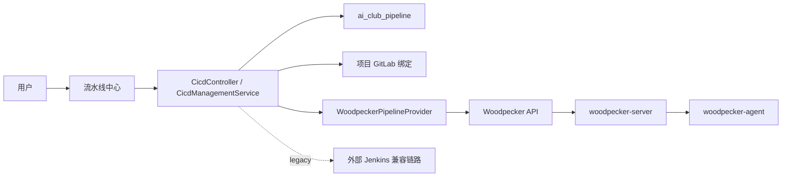

# Woodpecker 直集成 Pipeline Provider 技术设计 v1

## 1. 背景与目标

AI Club 的流水线能力从“维护外部 Jenkins 服务并绑定 Job”升级为“平台内置流水线中心”。Woodpecker 不作为用户可新增的第三方服务实例，而是作为 AI Club Pipeline 的默认 provider，由平台负责部署配置、仓库同步、触发、历史读取和日志聚合。

本方案目标：

- 用户在项目里创建 AI Club Pipeline，只选择平台项目、GitLab 绑定、默认分支和 `.woodpecker.yml` 路径。
- 平台使用部署级 Woodpecker Token 调用 Woodpecker API，不在前端暴露 Woodpecker 服务 CRUD，也不要求业务用户登录 Woodpecker。
- Jenkins 保留为外部 Jenkins 兼容能力，继续服务原 `project_pipeline_binding` 链路。
- 第一版状态和日志按需 API 拉取，不接 Webhook，不落本地运行明细，不进入执行中心。

## 2. 架构边界

边界说明：

- `ai_club_pipeline` 保存平台流水线定义和最近运行摘要；Woodpecker 仍是运行明细、日志和执行状态主数据源。
- `project_pipeline_binding` 不迁移，不承载 Woodpecker，只保留 Jenkins legacy binding。
- `CicdManagementService.tryTriggerProjectPipeline` 先触发启用的 AI Club Pipeline；没有可用内置流水线时再走 legacy Jenkins 绑定。
- Woodpecker provider 的连接信息来自部署配置，不进入系统“新增服务”页面；Woodpecker UI 视为管理员排障入口，业务用户只使用 AI Club 的平台登录与权限。

## 3. 数据模型

新增 Flyway 脚本：`V71__ai_club_pipeline_woodpecker.sql`。

核心表：`ai_club_pipeline`

- `project_id`：业务项目，数据权限跟随项目。
- `gitlab_binding_id`：项目 GitLab 仓库绑定，用于把平台项目流水线关联到代码仓库。
- `name`：平台内流水线名称，同项目下唯一。
- `provider_code`：首版固定 `WOODPECKER`，保留扩展位。
- `default_branch`：默认触发分支；未填时回退 GitLab 绑定默认分支。
- `config_path`：Woodpecker YAML 配置路径，默认 `.woodpecker.yml`。
- `woodpecker_repo_id / woodpecker_repo_full_name / woodpecker_repo_url`：平台同步仓库后的远端快照。
- `last_run_status / last_run_message / last_run_number / last_run_url / last_triggered_at`：最近一次由平台触发或同步后的摘要。

## 4. 后端接口

新增接口均挂在 `/api/cicd`：

- `GET /woodpecker/health`：读取内置 provider 健康状态。
- `GET /pipeline-config-templates`：读取平台内置 Woodpecker YAML 模板。
- `GET /pipelines`：分页查询 AI Club Pipeline。
- `POST /pipelines`：新建流水线并同步 Woodpecker 仓库。
- `PUT /pipelines/{id}`：更新流水线并重新同步仓库。
- `DELETE /pipelines/{id}`：删除平台流水线定义。
- `POST /pipelines/{id}/sync-repository`：手动同步或激活 Woodpecker 仓库。
- `POST /pipelines/{id}/trigger`：触发流水线。
- `GET /pipelines/{id}/config/status`：检查目标分支是否已存在配置文件。
- `POST /pipelines/{id}/config/preview`：按模板渲染可编辑的 YAML 预览。
- `POST /pipelines/{id}/config/complete`：创建补全配置文件的 GitLab 分支、commit 和 MR。
- `GET /pipelines/{id}/runs`：按需读取 Woodpecker 运行历史。
- `GET /pipelines/{id}/runs/{runNumber}/log`：聚合读取单次运行日志。

Jenkins 原接口继续保留在 `/jenkins-servers` 与 `/pipeline-bindings` 下，前端入口降级为“外部 Jenkins”。

## 5. Woodpecker API 适配

`WoodpeckerApiService` 通过 `Authorization: Bearer <token>` 调用 Woodpecker：

- `GET /api/user`：健康检查只用于确认平台 Token 可用，返回给业务用户的健康信息不展示 Woodpecker 技术账号身份。
- `GET /api/repos/lookup/{repo}`：按 GitLab 项目路径查找已激活仓库。
- `POST /api/repos?forge_remote_id=...`：按 GitLab 项目 ID 激活仓库。
- `GET /api/repos/{repo_id}/pipelines`：读取运行历史。
- `POST /api/repos/{repo_id}/pipelines`：触发运行。
- `GET /api/repos/{repo_id}/logs/{pipeline_number}/{step_id}`：聚合日志。

第一版失败处理策略：

- provider 未启用或缺 Token 时，接口返回明确业务错误。
- 同步仓库失败不创建伪数据，保留用户可在页面点击“同步仓库”重试。
- 触发前会先通过 GitLab API 校验目标分支存在配置文件路径（默认 `.woodpecker.yml`）；仓库同步成功只代表 Woodpecker repo 已激活，不代表业务流水线已经配置。
- 触发失败会写入最近运行失败摘要并抛出异常，方便首页和流水线中心展示。

## 5.1 配置文件模板与补全

平台内置六类 Woodpecker YAML 模板：Java / Maven、Node / Vite、Python / FastAPI、Docker Buildx、SSH 远程部署、通用 Shell。模板由后端代码维护，不落数据库，也不提供多租户模板 CRUD。模板不再只给一段待编辑 YAML，而是同时返回参数定义；前端默认以表单方式呈现项目根目录、触发分支、命令、推送服务器地址、镜像仓库、SSH 主机和私钥等模板元素，后端根据 `templateCode + parameters` 重新渲染 YAML。高级用户仍可切换到“手动 YAML”模式，继续按自定义内容创建 MR。

补全链路固定走 GitLab MR，不直接写目标分支：

1. 前端读取 `/pipelines/{id}/config/status`，缺文件时展示“补全配置”入口。
2. 用户选择模板并填写参数，前端调用预览接口，后端按流水线、目标分支、GitLab 项目路径和参数渲染 YAML。
3. 用户也可以切换手动 YAML 模式，保留完全自定义配置文件的路径。
4. 用户确认后，平台创建 `ai-club/pipeline-config/{pipelineId}-{timestamp}` 分支。
5. 平台提交配置文件并创建 MR 到目标分支。
6. 目标分支如果已经存在配置文件，补全接口拒绝覆盖。

`部署到服务器` 现在作为共享后置动作挂在 Java / Maven、Node / Vite、Python / FastAPI、Docker Buildx、通用 Shell 等模板里，通过开关启用，而不是再拆新的模板类型。Woodpecker runner 会基于当前提交自动检出源码，因此“拉最新代码”由 CI checkout 隐式完成；当用户打开后置部署开关后，页面会额外展示 `部署 SSH 主机 / 端口 / 用户 / 私钥 / 部署产物路径 / 服务器目标路径 / 重启脚本` 等参数，模板会在构建步骤后自动追加 `scp/ssh` 部署步骤。各模板还支持 `项目根目录`，用于 monorepo 或多模块仓库里指定真正包含 `pom.xml`、`package.json`、Python 应用代码或 Docker build context 的子目录；构建命令、Docker context 与部署产物路径都会优先按这个目录解析。`部署产物路径` 可留空，此时只执行远程脚本，适合 Docker 镜像已经推到 registry 后让服务器 `docker compose pull && up -d`。Docker Buildx 模板生成真实推送配置，使用 `woodpeckerci/plugin-docker-buildx:2`，页面填写 `registry / repo / tags / username / password / branch` 等参数；YAML 中只保留 `from_secret` 引用，平台在创建 MR 前把账号密码和部署私钥 upsert 到当前 Woodpecker repo secrets。SSH 远程部署模板仍保留给“只跑远程脚本、不依赖前置构建”的场景。手动 YAML 模式不强制托管 secrets，适合已经自行维护 Woodpecker secrets 的高级配置。

## 6. 部署配置

新增环境变量：

- `WOODPECKER_ENABLED`：是否启用内置 Woodpecker provider 与 Compose profile，默认 `true`。
- `WOODPECKER_PORT / WOODPECKER_HOST / WOODPECKER_DATA_DIR / WOODPECKER_AGENT_DATA_DIR`
- `WOODPECKER_AGENT_SECRET`
- `PLATFORM_WOODPECKER_INTERNAL_BASE_URL`
- `PLATFORM_WOODPECKER_PUBLIC_BASE_URL`
- `PLATFORM_WOODPECKER_API_TOKEN`
- `PLATFORM_WOODPECKER_TIMEOUT_SECONDS`

Compose 新增 `woodpecker-server` 与 `woodpecker-agent`，放入 `woodpecker` profile。脚本默认传入 `--profile woodpecker` 并等待 `WOODPECKER_PORT`，只有显式设置 `WOODPECKER_ENABLED=false` 才跳过。全量 Docker 下后端默认使用 `http://woodpecker-server:8000` 调用内部服务；源码模式默认使用宿主机端口 `http://localhost:18000`。

AI Club 不再在 `.env` / `.env.server` 中暴露 Woodpecker 的 GitLab OAuth 或登录开放配置。业务用户不登录 Woodpecker；AI Club 后端使用 `PLATFORM_WOODPECKER_API_TOKEN` 代表平台调用 Woodpecker API。Woodpecker 运行时如果仍需要底座 forge 兼容配置，应放在 `.data/woodpecker/forge.env` 或服务器等价运行数据文件里，不进入 AI Club 平台配置。代码仓库身份、MR 与自动合并继续走平台已有 GitLab 配置。

## 7. 前端体验

- `CI/CD` 入口改为“流水线中心”，首屏展示 AI Club Pipeline 卡片总览。
- 页面顶部展示平台托管执行底座健康状态，不暴露 Woodpecker 登录入口。
- 新建流水线只选择项目、GitLab 绑定、分支和配置文件路径，不出现“新增 Woodpecker 服务”表单。
- 列表页只保留卡片浏览和高频操作：触发、同步仓库、补全配置；点击卡片进入详情页。
- 详情页采用 Hero + Tabs，统一承载基础信息、运行历史和聚合日志；补全弹窗默认展示模板参数表单和只读预览，并保留手动 YAML 模式；运行排障优先使用平台聚合日志，不要求打开 Woodpecker UI。
- Jenkins 管理页保留为“外部 Jenkins”，用于兼容已有外部 CI。
- 首页快速构建改为读取 AI Club Pipeline，并默认触发内置流水线。
- GitLab 自动合并文案统一为“合并后触发流水线”，由 `tryTriggerProjectPipeline` 自动选择内置 provider 或 legacy Jenkins 兼容链路。

## 8. 迁移策略

- 不自动迁移 `project_pipeline_binding` 到 `ai_club_pipeline`。
- 已有 Jenkins 配置继续可用，权限仍使用 `cicd:view / cicd:manage / cicd:build`。
- 管理员可以按项目新建 AI Club Pipeline，逐步从外部 Jenkins 绑定迁移。

## 9. 验证清单

- 后端：Woodpecker 健康、同步仓库、配置状态、模板预览、补全 MR、触发成功、触发失败、Jenkins legacy 触发不回归。
- 前端：流水线卡片总览、详情页、新建、同步、补全配置、触发、历史、日志、移动端与首页快速构建。
- 部署：默认拉起 Woodpecker；`WOODPECKER_ENABLED=false` 时脚本不带 `woodpecker` profile。
- 全量：`python scripts/check_encoding.py`、`cd backend && mvn -s maven-settings-central.xml test`、`cd frontend && npm run build`。

## 10. 参考

- Woodpecker Docker Compose 安装说明：`https://woodpecker-ci.org/docs/administration/installation/docker-compose`
- Woodpecker Server 配置：`https://woodpecker-ci.org/docs/administration/configuration/server`
- Woodpecker Agent 配置：`https://woodpecker-ci.org/docs/administration/configuration/agent`
- Woodpecker Workflow syntax：`https://woodpecker-ci.org/docs/3.12/usage/workflow-syntax`
- Woodpecker Docker Buildx 插件：`https://woodpecker-ci.org/plugins/docker-buildx`
